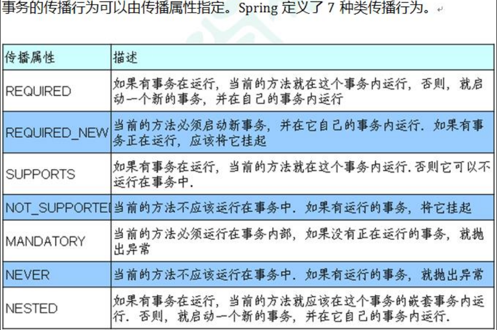
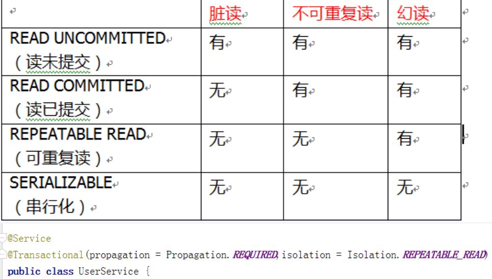

# Spring5框架

### Spring5框架概述

```java
1、Spring是轻量级的开源的JavaEE框架
2、Spring可以解决企业应用开发的复杂性
3、Spring有两个核心部分：IOC和Aop
    (1)IOC:控制反射，把创建对象过程交给Spring进行管理
    	IOC容器：
    		1、IOC底层原理
    		2、IOC接口(BeanFactory)
    		3、IOC操作Bean管理(基于xml)
    		4、IOC操作Bean管理(基于注解)
    (2)Aop:面向切面，不修改源代码进行功能增强
4、Spring特点
    (1)方便解耦，简化开发
    (2)Aop编程支持
    (3)方便程序测试
    (4)方便和其他框架进行整合
    (5)方便进行事务操作
    (6)降低API开发难度
```

### IOC(概念和原理)🔺

```java
1、什么是IOC
	(1)控制反转，把对象创建和对象之间的调用过程，交给Spring进行管理
	(2)使用IOC目的：为了耦合度降低
2、IOC底层原理
    (1)xml解析、工厂模式、反射
3、IOC底层原理(描述)
IOC过程	    进一步降低耦合度
    第一步：xml配置文件，配置创建的对象
    <<bean id="user" class="com.lmj.spring5.User"></bean>>
    第二步：有service类和user类，创建工厂类
    class UserFactory{
        public static UserDao getDao(){
            String classValue = Class.forName(classValue);//1、xml解析
            Class clazz = Class.forName(classValue);//2、通过反射创建对象
            return (UserDao)clazz.newInstance();
        }
    }
```

#### IOC接口

```java
1、IOC思想基于IOC容器完成，IOC容器底层就是对象工厂
2、Spring提供IOC容器实现两种方式：(两个接口)
    (1)BeanFactory:IOC容器基本实现，是Spring内容的使用接口，不提供开发人员进行使用 *加载配置文件时候不会创建对象，在获取对象(使用)才去创建对象
    (2)ApplicationContext:BeanFactory接口的子接口，提供更多更强大的功能，一般由开发人员进行使用 *加载配置文件就会把在配置文件对象创建
3、ApplicationContext接口实现类
    FileSystemXmlApplicationContext//绝对路径
    ClassPathXmlApplicationContext//相对路径  src/
```

#### IOC操作Bean管理(概念)

```jav
1、什么是Bean管理
	(1)Bean管理是指的是两个操作
	(2)Spring创建对象
	(3)Spring注入属性
2、Bean管理操作有两种方式
	(1)基于xml配置文件方式实现
	(2)基于注解方式实现
```

#### IOC操作Bean管理(基于xml方式)

```java
1、基于xml方式创建对象
    <!--配置User对象创建-->
    <bean id="user" class="com.lmj.spring5.User"></bean>
	(1)在spring配置文件中，使用bean标签，标签里面添加对应属性，就可以实现对象创建
    (2)在bean标签有很多属性，介绍常用的属性
        *id属性：唯一标识
        *class属性：类全路径 (包类路径)
    (3)创建对象时候，默认也是执行无参数构造方法完成对象创建
2、基于xml方式注入属性
	(1)DI:依赖注入，就是注入属性
```

##### 使用set方法进行注入

第一种注入方式:

```java
(1)创建类，定义属性和对应的set方法
    /**
 	* 使用set方法进行注入属性
 	*/
	public class Book {
        //创建属性
        private String bname;
        private String bauthor;
        //创建属性对应的set方法注入
        public void setBname(String bname) {
            this.bname = bname;
        }
        public void setBauthor(String bauthor) {
            this.bauthor = bauthor;
        }
    } 
	(2)在spring配置文件配置对象创建，配置属性注入
	<!--set方法注入属性-->
    <bean id="book" class="com.lmj.spring5.Book">
        <!--使用property完成属性注入
            name:类里面属性名称
            value:向属性注入的值
        -->
        <property name="bname" value="西游记"></property>
        <property name="bauthor" value="吴承恩"></property>
    </bean>  
```

##### 使用有参数构造进行注入

第二种注入方式

```java
(1)创建类，定义属性，创建属性对应有参数构造方法
/**
 * 使用有参数构造注入
 */
public class Orders {
    //属性
    private String oname;
    private String address;
    //有参数构造
    public Orders(String oname, String address) {
        this.oname = oname;
        this.address = address;
    }
}
(2)在spring配置文件中进行配置
    <!--有参数构造注入属性-->
    <bean id="orders" class="com.lmj.spring5.Orders">
        <constructor-arg name="oname" value="电脑配件"></constructor-arg>
        <constructor-arg name="address" value="China"></constructor-arg>
    </bean>    
```

##### p名称空间注入(了解)

```xml
(1)使用p名称空间注入，可以简化基于xml配置方式
<!第一步：添加p名称空间在配置文件中
<beans xmlns="http://www.springframework.org/schema/beans"
       xmlns:xsi="http://www.w3.org/2001/XMLSchema-instance"
       xmlns:p="http://www.springframework.org/schema/p"
       xsi:schemaLocation="http://www.springframework.org/schema/beans http://www.springframework.org/schema/beans/spring-beans.xsd">
<!第二步：进行属性注入，在Bean标签里面进行操作 
<bean id="book" class="com.lmj.spring5.Book" p:bname="软设" p:bauthor="张三"></bean>           
```

##### xml注入其他类型属性

```java
1、字面量
    (1)null值
    <!--null值-->
    <property name="address">
    	<null/>
    </property>
    (2)属性值包含特殊符号
    <!--属性值包含特殊符号
    	1 把<>进行转义
        2 把带特殊符号内容写到CDATA
    -->
    <property name="address">
		<value><![CDATA[<<男爵>>]]></value>
    </property>     
```

```java
2、注入属性-外部bean
    （1）创建两个类 service 类和 dao 类 
    （2）在 service 调用 dao 里面的方法
	（3）在 spring 配置文件中进行配置
    public class UserService {
    	private UserDao userDao;
    	public void setUserDao(UserDao userDao) {
        	this.userDao = userDao;
    	}
    	public void add(){
        	System.out.println("service add....");
        	userDao.update();
        }
    }	
	<!--1 service和dao对象创建-->
    <bean id="userService" class="com.lmj.spring5.service.UserService">
        <!--注入userDao对象
            name属性值：类里面属性名称
            ref属性：创建userDao对象bean标签id值
        -->
        <property name="userDao" ref="userDaoImpl"></property>
    </bean>
    <bean id="userDaoImpl" class="com.lmj.spring5.dao.UserDaoImpl"></bean>
```

```java
注入属性-内部 bean
（1）一对多关系：部门和员工
一个部门有多个员工，一个员工属于一个部门
部门是一，员工是多
（2）在实体类之间表示一对多关系，员工表示所属部门，使用对象类型属性进行表示
//部门类
public class Dept {
 private String dname;
 public void setDname(String dname) {
 this.dname = dname;
 } 
}
//员工类
public class Emp {
 private String ename;
 private String gender;
 //员工属于某一个部门，使用对象形式表示
 private Dept dept;
 public void setDept(Dept dept) {
 	this.dept = dept;
 }
 public void setEname(String ename) {
 	this.ename = ename;
 }
 public void setGender(String gender) {
 	this.gender = gender;
 } 
}
（3）在 spring 配置文件中进行配置
<!--内部 bean--> 
<bean id="emp" class="com.atguigu.spring5.bean.Emp">
	<!--设置两个普通属性-->
	<property name="ename" value="lucy"></property>
	<property name="gender" value="女"></property>
 	<!--设置对象类型属性-->
	<property name="dept">
 		<bean id="dept" class="com.atguigu.spring5.bean.Dept">
 			<property name="dname" value="安保部"></property>
 		</bean>
	</property>
</bean> 
```

```java
注入属性-级联赋值
（1）第一种写法 
<!--级联赋值--> <bean id="emp" class="com.atguigu.spring5.bean.Emp">
 <!--设置两个普通属性-->
 <property name="ename" value="lucy"></property>
 <property name="gender" value="女"></property>
 <!--级联赋值-->
 <property name="dept" ref="dept"></property>
</bean> 
<bean id="dept" class="com.atguigu.spring5.bean.Dept">
 <property name="dname" value="财务部"></property>
</bean>
（2）第二种写法
    //员工属于某一个部门，使用对象形式表示
    private Dept dept;
    //生成dept的get方法
    public Dept getDept() {
        return dept;
    }    
<!--级联赋值--> <bean id="emp" class="com.atguigu.spring5.bean.Emp">
 <!--设置两个普通属性-->
 <property name="ename" value="lucy"></property>
 <property name="gender" value="女"></property>
 <!--级联赋值-->
 <property name="dept" ref="dept"></property>
 <property name="dept.dname" value="技术部"></property>
</bean> <bean id="dept" class="com.atguigu.spring5.bean.Dept">
 <property name="dname" value="财务部"></property>
</bean>
```

##### xml注入集合属性

```java
1、注入数组类型属性
2、注入 List 集合类型属性
3、注入 Map 集合类型属性
（1）创建类，定义数组、list、map、set 类型属性，生成对应 set 方法
public class Stu {
 //1 数组类型属性
 private String[] courses;
 //2 list 集合类型属性
 private List<String> list;
 //3 map 集合类型属性
 private Map<String,String> maps;
 //4 set 集合类型属性
 private Set<String> sets;
 public void setSets(Set<String> sets) {
 	this.sets = sets;
 }
 public void setCourses(String[] courses) {
 	this.courses = courses;
 }
 public void setList(List<String> list) {
 	this.list = list;
 }
 public void setMaps(Map<String, String> maps) {
 	this.maps = maps;
 } 
}
（2）在 spring 配置文件进行配置
<!--1 集合类型属性注入--> 
<bean id="stu" class="com.atguigu.spring5.collectiontype.Stu">
 <!--数组类型属性注入-->
 <property name="courses">
     <array>
     <value>java 课程</value>
     <value>数据库课程</value>
     </array>
 </property>
 <!--list 类型属性注入-->
 <property name="list">
     <list>
     <value>张三</value>
     <value>小三</value>
     </list>
 </property>
 <!--map 类型属性注入-->
 <property name="maps">
     <map>
     <entry key="JAVA" value="java"></entry>
     <entry key="PHP" value="php"></entry>
     </map>
 </property>
 <!--set 类型属性注入-->
 <property name="sets">
     <set>
     <value>MySQL</value>
     <value>Redis</value>
     </set>
 </property>
</bean> 
```

```java
4、在集合里面设置对象类型值
<!--创建多个 course 对象--> 
<bean id="course1" class="com.atguigu.spring5.collectiontype.Course">
  <property name="cname" value="Spring5 框架"></property>
</bean> 
<bean id="course2" class="com.atguigu.spring5.collectiontype.Course">
  <property name="cname" value="MyBatis 框架"></property>
</bean>
<!--注入 list 集合类型，值是对象--> 
<property name="courseList">
 <list>
  <ref bean="course1"></ref>
  <ref bean="course2"></ref>
< /list>
</property> 
    
5、把集合注入部分提取出来
（1）在 spring 配置文件中引入名称空间 util
<?xml version="1.0" encoding="UTF-8"?>
<beans xmlns="http://www.springframework.org/schema/beans"
 xmlns:xsi="http://www.w3.org/2001/XMLSchema-instance"
 xmlns:p="http://www.springframework.org/schema/p"
 xmlns:util="http://www.springframework.org/schema/util"
 xsi:schemaLocation="http://www.springframework.org/schema/beans 
http://www.springframework.org/schema/beans/spring-beans.xsd
 http://www.springframework.org/schema/util 
http://www.springframework.org/schema/util/spring-util.xsd"> （2）使用 util 标签完成 list 集合注入提取
<!--1 提取 list 集合类型属性注入--> 
<util:list id="bookList">
 <value>易筋经</value>
 <value>九阴真经</value>
 <value>九阳神功</value>
</util:list>
<!--2 提取 list 集合类型属性注入使用--> 
<bean id="book" class="com.atguigu.spring5.collectiontype.Book">
 <property name="list" ref="bookList"></property>
</bean>
```

#### IOC操作Bean管理

##### 基于xml注入方式

###### FactoryBean

```java
1、Spring 有两种类型 bean，一种普通 bean，另外一种工厂 bean（FactoryBean） 
2、普通 bean：在配置文件中定义 bean 类型就是返回类型
3、工厂 bean：在配置文件定义 bean 类型可以和返回类型不一样
第一步 创建类，让这个类作为工厂 bean，实现接口 FactoryBean
第二步 实现接口里面的方法，在实现的方法中定义返回的 bean 类型
public class MyBean implements FactoryBean<Course> {
 //定义返回 bean
 @Override
 public Course getObject() throws Exception {
 	Course course = new Course();
 	course.setCname("abc");
 	return course;
 }
 @Override
 public Class<?> getObjectType() {
 	return null;
 }
 @Override
 public boolean isSingleton() {
 	return false;
 } 
}

<bean id="myBean" class="com.atguigu.spring5.factorybean.MyBean">
</bean>
    
@Test
public void test3() {
 ApplicationContext context =
 new ClassPathXmlApplicationContext("bean3.xml");
 Course course = context.getBean("myBean", Course.class);
 System.out.println(course);
}
```

###### bean作用域

```java
1、在 Spring 里面，设置创建 bean 实例是单实例还是多实例
2、在 Spring 里面，默认情况下，bean 是单实例对象
    Book book = context.getBean("book", Book.class);
	Book book1 = context.getBean("book", Book.class);
	System.out.println(book);
	System.out.println(book1);
com.lmj.spring5.collectiontype.Book@2641e737
com.lmj.spring5.collectiontype.Book@2641e737
    
3、如何设置单实例还是多实例
（1）在 spring 配置文件 bean 标签里面有属性（scope）用于设置单实例还是多实例
（2）scope 属性值
第一个值 默认值，singleton，表示是单实例对象
第二个值 prototype，表示是多实例对象
<bean id="book" class="com.lmj.spring5.collectiontype.Book" scope="prototype">
	<property name="list" ref="bookList"></property>
</bean>  
com.lmj.spring5.collectiontype.Book@2641e737
com.lmj.spring5.collectiontype.Book@727803de
（3）singleton 和 prototype 区别
	第一 singleton 单实例，prototype 多实例
	第二 设置 scope 值是 singleton 时候，加载 spring 配置文件时候就会创建单实例对象
 		设置 scope 值是 prototype 时候，不是在加载 spring 配置文件时候创建 对象，在调用
getBean 方法时候创建多实例对象
```

###### bean生命周期

```java
1、生命周期
（1）从对象创建到对象销毁的过程
2、bean 生命周期
（1）通过构造器创建 bean 实例（无参数构造）
（2）为 bean 的属性设置值和对其他 bean 引用（调用 set 方法）
（3）调用 bean 的初始化的方法（需要进行配置初始化的方法）
（4）bean 可以使用了（对象获取到了）
（5）当容器关闭时候，调用 bean 的销毁的方法（需要进行配置销毁的方法）
3、演示 bean 生命周期
public class Orders {
 //无参数构造
 public Orders() {
 	System.out.println("第一步 执行无参数构造创建 bean 实例");
 }
 private String oname;
 public void setOname(String oname) {
 	this.oname = oname;
 	System.out.println("第二步 调用 set 方法设置属性值");
 }
 //创建执行的初始化的方法
 public void initMethod() {
 	System.out.println("第三步 执行初始化的方法");
 }
 //创建执行的销毁的方法
 public void destroyMethod() {
 	System.out.println("第五步 执行销毁的方法");
 } 
}

<bean id="orders" class="com.atguigu.spring5.bean.Orders" initmethod="initMethod" destroy-method="destroyMethod">
 <property name="oname" value="手机"></property>
</bean>
    
@Test
public void testBean3() {
// ApplicationContext context =
// new ClassPathXmlApplicationContext("bean4.xml");
 ClassPathXmlApplicationContext context =
 new ClassPathXmlApplicationContext("bean4.xml");
 Orders orders = context.getBean("orders", Orders.class);
 System.out.println("第四步 获取创建 bean 实例对象");
 System.out.println(orders);
 //手动让 bean 实例销毁
 context.close();
}
	1 执行无惨构造创建bean实例
	2 调用set方法设置属性的值
	3 执行初始化的方法
	4 获取创建bean实例对象
	com.lmj.spring5.Bean.Orders@491cc5c9
	5 执行销毁的方法
```

```java
4、bean 的后置处理器，bean 生命周期有七步
（1）通过构造器创建 bean 实例（无参数构造）
（2）为 bean 的属性设置值和对其他 bean 引用（调用 set 方法）
（3）把 bean 实例传递 bean 后置处理器的方法 postProcessBeforeInitialization （4）调用 bean 的初始化的方法（需要进行配置初始化的方法）
（5）把 bean 实例传递 bean 后置处理器的方法 postProcessAfterInitialization
（6）bean 可以使用了（对象获取到了）
（7）当容器关闭时候，调用 bean 的销毁的方法（需要进行配置销毁的方法）
5、演示添加后置处理器效果
（1）创建类，实现接口 BeanPostProcessor，创建后置处理器
public class MyBeanPost implements BeanPostProcessor {
 @Override
 public Object postProcessBeforeInitialization(Object bean, String beanName) 
throws BeansException {
 	System.out.println("在初始化之前执行的方法");
 	return bean;
 }
 @Override
 public Object postProcessAfterInitialization(Object bean, String beanName) 
throws BeansException {
 	System.out.println("在初始化之后执行的方法");
 	return bean;
 } }
<!--配置后置处理器--> 
<bean id="myBeanPost" class="com.atguigu.spring5.bean.MyBeanPost"></bean>
1 执行无惨构造创建bean实例
2 调用set方法设置属性的值
在初始化之前执行的方法
3 执行初始化的方法
在初始化之后执行的方法
4 获取创建bean实例对象
com.lmj.spring5.Bean.Orders@462d5aee
5 执行销毁的方法
```

###### xml自动装配

```java
1、什么是自动装配
（1）根据指定装配规则（属性名称或者属性类型），Spring 自动将匹配的属性值进行注入
2、演示自动装配过程
（1）根据属性名称自动注入
    <!--实现自动装配
     bean 标签属性 autowire，配置自动装配
     autowire 属性常用两个值：
     byName 根据属性名称注入 ，注入值 bean 的 id 值和类属性名称一样
     byType 根据属性类型注入
    -->
<bean id="emp" class="com.atguigu.spring5.autowire.Emp" autowire="byName">
	<!--<property name="dept" ref="dept"></property>-->
</bean> 
<bean id="dept" class="com.atguigu.spring5.autowire.Dept"></bean> 
（2）根据属性类型自动注入
    <!--实现自动装配
     bean 标签属性 autowire，配置自动装配
     autowire 属性常用两个值：
     byName 根据属性名称注入 ，注入值 bean 的 id 值和类属性名称一样
     byType 根据属性类型注入
    -->
<bean id="emp" class="com.atguigu.spring5.autowire.Emp" autowire="byType">
	<!--<property name="dept" ref="dept"></property>-->
</bean> 
<bean id="dept" class="com.atguigu.spring5.autowire.Dept"></bean>
```

###### 外部属性文件

```java
1、直接配置数据库信息
（1）配置德鲁伊连接池
（2）引入德鲁伊连接池依赖 jar 包
<!--直接配置连接池--> 
<bean id="dataSource" class="com.alibaba.druid.pool.DruidDataSource">
 <property name="driverClassName" value="com.mysql.jdbc.Driver"></property>
 <property name="url" 
value="jdbc:mysql://localhost:3306/userDb"></property>
 <property name="username" value="root"></property>
 <property name="password" value="root"></property>
</bean>  
    
2、引入外部属性文件配置数据库连接池
（1）创建外部属性文件，properties 格式文件，写数据库信息
	prop.driverClass=com.mysql.jdbc.Driver
	prop.url=jdbc:mysql://localhost:3306/userDb
	prop.userName=root
	prop.password=root   
（2）把外部 properties 属性文件引入到 spring 配置文件中
* 引入 context 名称空间
<beans xmlns="http://www.springframework.org/schema/beans" 
 xmlns:xsi="http://www.w3.org/2001/XMLSchema-instance" 
 xmlns:p="http://www.springframework.org/schema/p" 
 xmlns:context="http://www.springframework.org/schema/context" 
 xsi:schemaLocation="http://www.springframework.org/schema/beans 
http://www.springframework.org/schema/beans/spring-beans.xsd 
 http://www.springframework.org/schema/context 
http://www.springframework.org/schema/context/spring-context.xsd"> 
<!--引入外部属性文件--> 
<context:property-placeholder location="classpath:jdbc.properties"/>
<!--配置连接池--> 
<bean id="dataSource" class="com.alibaba.druid.pool.DruidDataSource">
 <property name="driverClassName" value="${prop.driverClass}"></property>
 <property name="url" value="${prop.url}"></property>
 <property name="username" value="${prop.userName}"></property>
 <property name="password" value="${prop.password}"></property>
</bean>
```

##### 基于注解方式

```java
1、什么是注解
（1）注解是代码特殊标记，格式：@注解名称(属性名称=属性值, 属性名称=属性值..)
（2）使用注解，注解作用在类上面，方法上面，属性上面
（3）使用注解目的：简化 xml 配置
2、Spring 针对 Bean 管理中创建对象提供注解
（1）@Component
（2）@Service
（3）@Controller
（4）@Repository
* 上面四个注解功能是一样的，都可以用来创建 bean 实例
```

###### 实现对象创建

```java
第一步 引入依赖 spring-aop-5.2.6.RELEASE.jar
第二步 开启组件扫描
<!--开启组件扫描
 1 如果扫描多个包，多个包使用逗号隔开
 2 扫描包上层目录
-->
<context:component-scan base-package="com.atguigu"></context:component-scan>
第三步 创建类，在类上面添加创建对象注解
//在注解里面 value 属性值可以省略不写，
//默认值是类名称，首字母小写
//UserService -- userService
@Component(value = "userService") //<bean id="userService" class=".."/>
public class UserService {
	public void add() {
 		System.out.println("service add.......");
	} 
}    
```

###### 开启组件扫描细节配置

```java
<!--示例 1
 use-default-filters="false" 表示现在不使用默认 filter，自己配置 filter
 context:include-filter ，设置扫描哪些内容
-->
<context:component-scan base-package="com.atguigu" use-default-filters="false">
 <context:include-filter type="annotation" 
 expression="org.springframework.stereotype.Controller"/>
</context:component-scan>
<!--示例 2
 下面配置扫描包所有内容
 context:exclude-filter： 设置哪些内容不进行扫描
-->
<context:component-scan base-package="com.atguigu">
 <context:exclude-filter type="annotation" 
expression="org.springframework.stereotype.Controller"/>
</context:component-scan>
```

###### 实现属性注入

```java
（1）@Autowired：根据属性类型进行自动装配
第一步 把 service 和 dao 对象创建，在 service 和 dao 类添加创建对象注解
第二步 在 service 注入 dao 对象，在 service 类添加 dao 类型属性，在属性上面使用注解
@Service
public class UserService {
 //定义 dao 类型属性
 //不需要添加 set 方法
 //添加注入属性注解
 @Autowired 
 private UserDao userDao;
 public void add() {
 	System.out.println("service add.......");
 	userDao.add();
 } 
}
（2）@Qualifier：根据名称进行注入
这个@Qualifier 注解的使用，和上面@Autowired 一起使用
//定义 dao 类型属性
//不需要添加 set 方法
//添加注入属性注解
@Autowired //根据类型进行注入
@Qualifier(value = "userDaoImpl1") //根据名称进行注入
private UserDao userDao;

@Repository(value = "userDaoImpl")
public class UserDaoImpl implements UserDao{
    @Override
    public void add() {
        System.out.println("dao add....");
    }
}
（3）@Resource：可以根据类型注入，可以根据名称注入
    //@Resource //根据类型进行注入
    @Resource(name = "userDaoImpl1") //根据名称进行注入
    private UserDao userDao; 
（4）@Value：注入普通类型属性
    @Value(value = "abc")
    private String name;
```

### AOP(面向切面编程)🔺

```java
1、什么是 AOP
（1）面向切面编程（方面），利用 AOP 可以对业务逻辑的各个部分进行隔离，从而使得
业务逻辑各部分之间的耦合度降低，提高程序的可重用性，同时提高了开发的效率。
（2）通俗描述：不通过修改源代码方式，在主干功能里面添加新功能
```

#### AOP底层原理

```java
1、AOP 底层使用动态代理
（1）有两种情况动态代理
第一种 有接口情况，使用 JDK 动态代理
 创建接口实现类代理对象，增强类的方法
第二种 没有接口情况，使用 CGLIB 动态代理
 创建子类的代理对象，增强类的方法
```

#### AOP JDK动态代理

```java
1、使用 JDK 动态代理，使用 Proxy 类里面的方法创建代理对象
（1）调用 newProxyInstance 方法
static Object newProxyInstance(ClassLoader loader,类<?>[] interfaces,InvocationHandler h)返回指定接口的代理类的实例，该接口将 方法调用分派给指定的调用处理程序
方法有三个参数：
第一参数，类加载器
第二参数，增强方法所在的类，这个类实现的接口，支持多个接口
第三参数，实现这个接口 InvocationHandler，创建代理对象，写增强的部分
2、编写 JDK 动态代理代码
（1）创建接口，定义方法
public interface UserDao {
 public int add(int a,int b);
 public String update(String id);
}
（2）创建接口实现类，实现方法
public class UserDaoImpl implements UserDao {
 @Override
 public int add(int a, int b) {
 return a+b;
 }
 @Override
 public String update(String id) {
 return id;
 } 
}
（3）使用 Proxy 类创建接口代理对象
public class JDKProxy {
 public static void main(String[] args) {
 //创建接口实现类代理对象
  Class[] interfaces = {UserDao.class};
  UserDaoImpl userDao = new UserDaoImpl();
  UserDao dao = (UserDao)Proxy.newProxyInstance(JDKProxy.class.getClassLoader()，interfaces, new UserDaoProxy(userDao));
  int result = dao.add(1, 2);
  System.out.println("result:"+result);
 } 
}
//创建代理对象代码
class UserDaoProxy implements InvocationHandler {
 //1 把创建的是谁的代理对象，把谁传递过来
 //有参数构造传递
 private Object obj;
 public UserDaoProxy(Object obj) {
 this.obj = obj;
 }
 //增强的逻辑
 @Override
 public Object invoke(Object proxy, Method method, Object[] args) throws 
Throwable {
 //方法之前
 System.out.println("方法之前执行...."+method.getName()+" :传递的参
数..."+ Arrays.toString(args));
 //被增强的方法执行
 Object res = method.invoke(obj, args);
 //方法之后
 System.out.println("方法之后执行...."+obj);
 return res;
 } 
}
```

#### AOP(术语)

```java
1、连接点
 类里面哪些方法可以被增强，这些方法称为连接点
2、切入点
 实际被真正增强的方法，称为切入点
3、通知(增强)
 (1)实际增强的逻辑部分称为通知(增强)
 (2)通知有多种类型
    * 前置通知
    * 后置通知
    * 环绕通知
    * 异常通知
    * 最终通知
4、切面
 是动作
 (1)把通知应用到切入点过程
```

#### AOP操作(准备工作)

```java
1、Spring 框架一般都是基于 AspectJ 实现 AOP 操作
（1）AspectJ 不是 Spring 组成部分，独立 AOP 框架，一般把 AspectJ 和 Spirng 框架一起使用，进行 AOP 操作
2、基于 AspectJ 实现 AOP 操作
（1）基于 xml 配置文件实现
（2）基于注解方式实现（使用）
3、在项目工程里面引入 AOP 相关依赖
4、切入点表达式
（1）切入点表达式作用：知道对哪个类里面的哪个方法进行增强
（2）语法结构： execution([权限修饰符] [返回类型] [类全路径] [方法名称]([参数列表]) )
举例 1：对 com.atguigu.dao.BookDao 类里面的 add 进行增强
execution(* com.atguigu.dao.BookDao.add(..))
举例 2：对 com.atguigu.dao.BookDao 类里面的所有的方法进行增强
execution(* com.atguigu.dao.BookDao.* (..))
举例 3：对 com.atguigu.dao 包里面所有类，类里面所有方法进行增强
execution(* com.atguigu.dao.*.* (..))
```

#### AOP操作(AspectJ注解)🔺

```java
1、创建类，在类里面定义方法
public class User {
 public void add() {
 System.out.println("add.......");
 } 
}

2、创建增强类（编写增强逻辑）
（1）在增强类里面，创建方法，让不同方法代表不同通知类型
//增强的类
public class UserProxy {
 public void before() {//前置通知
 System.out.println("before......");
 } 
}

3、进行通知的配置
（1）在 spring 配置文件中，开启注解扫描
<?xml version="1.0" encoding="UTF-8"?>
<beans xmlns="http://www.springframework.org/schema/beans" 
 xmlns:xsi="http://www.w3.org/2001/XMLSchema-instance" 
 xmlns:context="http://www.springframework.org/schema/context" 
 xmlns:aop="http://www.springframework.org/schema/aop" 
 xsi:schemaLocation="http://www.springframework.org/schema/beans 
http://www.springframework.org/schema/beans/spring-beans.xsd 
 http://www.springframework.org/schema/context 
http://www.springframework.org/schema/context/spring-context.xsd 
 http://www.springframework.org/schema/aop 
http://www.springframework.org/schema/aop/spring-aop.xsd">
 <!-- 开启注解扫描 -->
 <context:component-scan basepackage="com.atguigu.spring5.aopanno"></context:component-scan> 
（2）使用注解创建 User 和 UserProxy 对象
@Component
public class UserProxy {}
@Component
public class User {}
（3）在增强类上面添加注解 @Aspect
//增强的类
@Component
@Aspect //生成代理对象
public class UserProxy {
（4）在 spring 配置文件中开启生成代理对象
<!-- 开启 Aspect 生成代理对象--> <aop:aspectj-autoproxy></aop:aspectj-autoproxy> 
    
4、配置不同类型的通知
（1）在增强类的里面，在作为通知方法上面添加通知类型注解，使用切入点表达式配置
//增强的类
@Component
@Aspect //生成代理对象
public class UserProxy {
 //前置通知
 //@Before 注解表示作为前置通知
 @Before(value = "execution(* com.atguigu.spring5.aopanno.User.add(..))")
 public void before() {
  System.out.println("before.........");
 }
 //后置通知（返回通知）
 @AfterReturning(value = "execution(* 
com.atguigu.spring5.aopanno.User.add(..))")
 public void afterReturning() {
  System.out.println("afterReturning.........");
 }
 //最终通知
 @After(value = "execution(* com.atguigu.spring5.aopanno.User.add(..))")
 public void after() {
  System.out.println("after.........");
 }
 //异常通知
 @AfterThrowing(value = "execution(* 
com.atguigu.spring5.aopanno.User.add(..))")
 public void afterThrowing() {
  System.out.println("afterThrowing.........");
 }
 //环绕通知
 @Around(value = "execution(* com.atguigu.spring5.aopanno.User.add(..))")
 public void around(ProceedingJoinPoint proceedingJoinPoint) throws 
Throwable {
  System.out.println("环绕之前.........");
 //被增强的方法执行
 proceedingJoinPoint.proceed();
  System.out.println("环绕之后.........");
 } 
}
    
5、相同的切入点抽取
//相同切入点抽取
@Pointcut(value = "execution(* com.atguigu.spring5.aopanno.User.add(..))")
public void pointdemo() {
}
//前置通知
//@Before 注解表示作为前置通知
@Before(value = "pointdemo()")
public void before() {
 System.out.println("before.........");
}
    
6、有多个增强类多同一个方法进行增强，设置增强类优先级
（1）在增强类上面添加注解 @Order(数字类型值)，数字类型值越小优先级越高
@Component
@Aspect
@Order(1)
public class PersonProxy{}
    
7、完全使用注解开发 
（1）创建配置类，不需要创建 xml 配置文件 
@Configuration
@ComponentScan(basePackages = {"com.atguigu"})
@EnableAspectJAutoProxy(proxyTargetClass = true)
public class ConfigAop {
}
```

#### AOP操作(AspectJ配置文件)

```java
1、创建两个类，增强类和被增强类，创建方法
2、在 spring 配置文件中创建两个类对象
<!--创建对象--> <bean id="book" class="com.atguigu.spring5.aopxml.Book"></bean> <bean id="bookProxy" class="com.atguigu.spring5.aopxml.BookProxy"></bean> 
3、在 spring 配置文件中配置切入点
<!--配置 aop 增强--> <aop:config>
 <!--切入点-->
 <aop:pointcut id="p" expression="execution(* 
com.atguigu.spring5.aopxml.Book.buy(..))"/>
 <!--配置切面-->
 <aop:aspect ref="bookProxy">
 <!--增强作用在具体的方法上-->
 <aop:before method="before" pointcut-ref="p"/>
 </aop:aspect>
</aop:config>
```

### JdbcTemplate

```java
什么是 JdbcTemplate
//Spring 框架对 JDBC 进行封装，使用 JdbcTemplate 方便实现对数据库操作
```

**准备工作**

```java
//（1）引入相关 jar 包
    druid-1.1.9.jar
    mysql-connector-java-5.1.7-bin.jar
    spring-jdbc-5.2.6.RELEASE.jar
    spring-orm-5.2.6.RELEASE.jar
    spring-tx-5.2.6.RELEASE.jar
//（2）在 spring 配置文件配置数据库连接池
<!-- 数据库连接池 --> 
<bean id="dataSource" class="com.alibaba.druid.pool.DruidDataSource" 
 destroy-method="close">
	<property name="url" value="jdbc:mysql:///user_db" />
	<property name="username" value="root" />
	<property name="password" value="root" />
 	<property name="driverClassName" value="com.mysql.jdbc.Driver" />
</bean> 
//（3）配置 JdbcTemplate 对象，注入 DataSource
<!-- JdbcTemplate 对象 --> <bean id="jdbcTemplate" class="org.springframework.jdbc.core.JdbcTemplate">
 	<!--注入 dataSource-->
 	<property name="dataSource" ref="dataSource"></property>
</bean>  
//（4）创建 service 类，创建 dao 类，在 dao 注入 jdbcTemplate 对象
* 配置文件
<!-- 组件扫描 --> 
<context:component-scan base-package="com.atguigu"></context:component-scan>
//Service
@Service
public class BookService {
 	//注入 dao
 	@Autowired
 	private BookDao bookDao; 
}
//Dao
@Repository
public class BookDaoImpl implements BookDao {
 	//注入 JdbcTemplate
 	@Autowired
 	private JdbcTemplate jdbcTemplate; 
}    
```

#### JdbcTemplate操作数据库

##### 添加

```java
//1、对应数据库创建实体类
//2、编写 service 和 dao
（1）在 dao 进行数据库添加操作
（2）调用 JdbcTemplate 对象里面 update 方法实现添加操作
update(String sql,Object... args)
// 有两个参数
// 第一个参数：sql 语句
// 第二个参数：可变参数，设置 sql 语句值    
@Repository
public class BookDaoImpl implements BookDao {
     //注入 JdbcTemplate
     @Autowired
     private JdbcTemplate jdbcTemplate;
     //添加的方法
     @Override
     public void add(Book book) {
     	//1 创建 sql 语句
     	String sql = "insert into t_book values(?,?,?)";
     	//2 调用方法实现
     	Object[] args = {book.getUserId(), book.getUsername(), book.getUstatus()};
     	int update = jdbcTemplate.update(sql,args);
     	System.out.println(update);
     } 
} 
//3、测试类
@Test
public void testJdbcTemplate() {
 	ApplicationContext context =
 new ClassPathXmlApplicationContext("bean1.xml");
 	BookService bookService = context.getBean("bookService", 
BookService.class);
 	Book book = new Book();
 	book.setUserId("1");
 	book.setUsername("java");
 	book.setUstatus("a");
 	bookService.addBook(book);
}
```

##### 修改和删除

```java
//1、修改
@Override
public void updateBook(Book book) {
 String sql = "update t_book set username=?,ustatus=? where user_id=?";
 Object[] args = {book.getUsername(), book.getUstatus(),book.getUserId()};
 int update = jdbcTemplate.update(sql, args);
 System.out.println(update);
}
//2、删除
@Override
public void delete(String id) {
 String sql = "delete from t_book where user_id=?";
 int update = jdbcTemplate.update(sql, id);
 System.out.println(update);
}
```

##### 查询返回某个值

```java
1、查询表里面有多少条记录，返回是某个值
2、使用 JdbcTemplate 实现查询返回某个值代码
queryForObject(String sql,Class<T> requiredType)
· 有两个参数 
· 第一个参数：sql 语句
· 第二个参数：返回类型 Class
//查询表记录数
@Override
public int selectCount() {
 String sql = "select count(*) from t_book";
 Integer count = jdbcTemplate.queryForObject(sql, Integer.class);
 return count;
}
```

##### 查询返回对象

```java
1、场景：查询图书详情
2、JdbcTemplate 实现查询返回对象
queryForObject(String sql,RowMapper<T> rowMapper,Object... args)    
· 有三个参数 
· 第一个参数：sql 语句
· 第二个参数：RowMapper 是接口，针对返回不同类型数据，使用这个接口里面实现类完成
数据封装
· 第三个参数：sql 语句值
//查询返回对象
@Override
public Book findBookInfo(String id) {
 String sql = "select * from t_book where user_id=?";
 //调用方法
 Book book = jdbcTemplate.queryForObject(sql, new 
BeanPropertyRowMapper<Book>(Book.class), id);
 return book;
}
```

##### 查询返回集合

```java
1、场景：查询图书列表分页… 
2、调用 JdbcTemplate 方法实现查询返回集合
· 有三个参数 
· 第一个参数：sql 语句
· 第二个参数：RowMapper 是接口，针对返回不同类型数据，使用这个接口里面实现类完成
数据封装
· 第三个参数：sql 语句值
//查询返回集合
@Override
public List<Book> findAllBook() {
 String sql = "select * from t_book";
 //调用方法
 List<Book> bookList = jdbcTemplate.query(sql, new 
BeanPropertyRowMapper<Book>(Book.class));
 return bookList;
}
```

##### 批量操作

```java
//批量添加
1、批量操作：操作表里面多条记录
2、JdbcTemplate 实现批量添加操作
· 有两个参数 
· 第一个参数：sql 语句
· 第二个参数：List 集合，添加多条记录数据
//批量添加
@Override
public void batchAddBook(List<Object[]> batchArgs) {
 String sql = "insert into t_book values(?,?,?)";
 int[] ints = jdbcTemplate.batchUpdate(sql, batchArgs);
 System.out.println(Arrays.toString(ints));
}
//批量添加测试
List<Object[]> batchArgs = new ArrayList<>();
Object[] o1 = {"3","java","a"};
Object[] o2 = {"4","c++","b"};
Object[] o3 = {"5","MySQL","c"};
batchArgs.add(o1);
batchArgs.add(o2);
batchArgs.add(o3);
//调用批量添加
bookService.batchAdd(batchArgs);

//批量修改
@Override
public void batchUpdateBook(List<Object[]> batchArgs) {
 String sql = "update t_book set username=?,ustatus=? where user_id=?";
 int[] ints = jdbcTemplate.batchUpdate(sql, batchArgs);
 System.out.println(Arrays.toString(ints));
}
//批量修改
List<Object[]> batchArgs = new ArrayList<>();
Object[] o1 = {"java0909","a3","3"};
Object[] o2 = {"c++1010","b4","4"};
Object[] o3 = {"MySQL1111","c5","5"};
batchArgs.add(o1);
batchArgs.add(o2);
batchArgs.add(o3);
//调用方法实现批量修改
bookService.batchUpdate(batchArgs);

//批量删除
@Override
public void batchDeleteBook(List<Object[]> batchArgs) {
 String sql = "delete from t_book where user_id=?";
 int[] ints = jdbcTemplate.batchUpdate(sql, batchArgs);
 System.out.println(Arrays.toString(ints));
}
//批量删除
List<Object[]> batchArgs = new ArrayList<>();
Object[] o1 = {"3"};
Object[] o2 = {"4"};
batchArgs.add(o1);
batchArgs.add(o2);
//调用方法实现批量删除
bookService.batchDelete(batchArgs);
```

### 事务操作

```java
1、什么事务
（1）事务是数据库操作最基本单元，逻辑上一组操作，要么都成功，如果有一个失败所有操
作都失败
2、事务四个特性（ACID） 
（1）原子性
（2）一致性
（3）隔离性
（4）持久性
```

#### 事务操作（环境）

```java
Server 业务操作 创建转账方法 1、调用dao两个的方法
Dao 数据库操作不写业务 创建两个方法 1、少钱的方法 2、多钱的方法
    
//1、创建 service，搭建 dao，完成对象创建和注入关系
service 注入 dao，在 dao 注入 JdbcTemplate，在 JdbcTemplate 注入 DataSource
@Service
public class UserService {
 //注入 dao
	 @Autowired
	 private UserDao userDao; 
}
@Repository
public class UserDaoImpl implements UserDao {
 	@Autowired
	 private JdbcTemplate jdbcTemplate; 
}

//2、在 dao 创建两个方法：多钱和少钱的方法，在 service 创建方法（转账的方法）
@Repository
public class UserDaoImpl implements UserDao {
 	@Autowired
 	private JdbcTemplate jdbcTemplate;
 	//lucy 转账 100 给 mary//少钱
 	@Override
 	public void reduceMoney() {
 		String sql = "update t_account set money=money-? where username=?";
 		jdbcTemplate.update(sql,100,"lucy");
 	}
 	//多钱
 	@Override
 	public void addMoney() {
 		String sql = "update t_account set money=money+? where username=?";
 		jdbcTemplate.update(sql,100,"mary");
 	} 
}
@Service
public class UserService {
 	//注入 dao
 	@Autowired
 	private UserDao userDao;
 	//转账的方法
 	public void accountMoney() {
 	//lucy 少 100
 	userDao.reduceMoney();
    int i = 10/0;
 	//mary 多 100
 	userDao.addMoney();
 	} 
}
```

#### 事务操作(注解声明式事务管理)

```java
1、在 spring 配置文件配置事务管理器
<!--创建事务管理器--> <bean id="transactionManager" 
class="org.springframework.jdbc.datasource.DataSourceTransactionManager">
 <!--注入数据源-->
 <property name="dataSource" ref="dataSource"></property>
</bean> 2、在 spring 配置文件，开启事务注解
 （1）在 spring 配置文件引入名称空间 tx
<beans xmlns="http://www.springframework.org/schema/beans" 
 xmlns:xsi="http://www.w3.org/2001/XMLSchema-instance" 
 xmlns:context="http://www.springframework.org/schema/context" 
 xmlns:aop="http://www.springframework.org/schema/aop" 
 xmlns:tx="http://www.springframework.org/schema/tx" 
 xsi:schemaLocation="http://www.springframework.org/schema/beans 
http://www.springframework.org/schema/beans/spring-beans.xsd 
 http://www.springframework.org/schema/context 
http://www.springframework.org/schema/context/spring-context.xsd 
 http://www.springframework.org/schema/aop 
http://www.springframework.org/schema/aop/spring-aop.xsd 
 http://www.springframework.org/schema/tx 
http://www.springframework.org/schema/tx/spring-tx.xsd"> 
 （2）开启事务注解
<!--开启事务注解--> <tx:annotation-driven transaction-manager="transactionManager" proxy-target-class="true"></tx:annotation-driven> 
3、在 service 类上面（或者 service 类里面方法上面）添加事务注解
（1）@Transactional，这个注解添加到类上面，也可以添加方法上面
（2）如果把这个注解添加类上面，这个类里面所有的方法都添加事务
（3）如果把这个注解添加方法上面，为这个方法添加事务
@Service
@Transactional
public class UserService {
```

#### 事务操作(声明式事务管理参数配置)

```java
1、在 service 类上面添加注解@Transactional，在这个注解里面可以配置事务相关参数
2、propagation：事务传播行为
（1）多事务方法直接进行调用，这个过程中事务 是如何进行管理的
    Spring框架事务传播行为有7种
```



```java
3、ioslation：事务隔离级别
（1）事务有特性成为隔离性，多事务操作之间不会产生影响。不考虑隔离性产生很多问题
（2）有三个读问题：脏读、不可重复读、虚（幻）读
（3）脏读：一个未提交事务读取到另一个未提交事务的数据
（4）不可重复读：一个未提交事务读取到另一提交事务修改数据
（5）虚读：一个未提交事务读取到另一提交事务添加数据
（6）解决：通过设置事务隔离级别，解决读问题    
```



```java
4、timeout：超时时间
（1）事务需要在一定时间内进行提交，如果不提交进行回滚
（2）默认值是 -1 ，设置时间以秒单位进行计算
5、readOnly：是否只读
（1）读：查询操作，写：添加修改删除操作
（2）readOnly 默认值 false，表示可以查询，可以添加修改删除操作
（3）设置 readOnly 值是 true，设置成 true 之后，只能查询
6、rollbackFor：回滚
（1）设置出现哪些异常进行事务回滚
7、noRollbackFor：不回滚
（1）设置出现哪些异常不进行事务回滚
```

#### 事务操作（XML声明式事务管理）

```java
1、在 spring 配置文件中进行配置
第一步 配置事务管理器
第二步 配置通知
第三步 配置切入点和切面
<!--1 创建事务管理器-->
 <bean id="transactionManager" 
class="org.springframework.jdbc.datasource.DataSourceTransactionManager">
 	<!--注入数据源-->
 	<property name="dataSource" ref="dataSource"></property>
</bean>
<!--2 配置通知--> 
 <tx:advice id="txadvice">
 	<!--配置事务参数-->
 	<tx:attributes>
 	<!--指定哪种规则的方法上面添加事务-->
 		<tx:method name="accountMoney" propagation="REQUIRED"/>
 		<!--<tx:method name="account*"/>-->
 	</tx:attributes>
</tx:advice>
<!--3 配置切入点和切面--> 
<aop:config>
 	<!--配置切入点-->
 	<aop:pointcut id="pt" expression="execution(* 
com.atguigu.spring5.service.UserService.*(..))"/>
 	<!--配置切面-->
 	<aop:advisor advice-ref="txadvice" pointcut-ref="pt"/>
</aop:config>
```

#### 事务操作（完全注解声明式事务管理）

```java
1、创建配置类，使用配置类替代 xml 配置文件
@Configuration //配置类
@ComponentScan(basePackages = "com.atguigu") //组件扫描
@EnableTransactionManagement //开启事务
public class TxConfig {
 	//创建数据库连接池
 	@Bean
     public DruidDataSource getDruidDataSource() {
     DruidDataSource dataSource = new DruidDataSource();
     dataSource.setDriverClassName("com.mysql.jdbc.Driver");
     dataSource.setUrl("jdbc:mysql:///user_db");
     dataSource.setUsername("root");
     dataSource.setPassword("root");
     return dataSource;
	}
    //创建 JdbcTemplate 对象
    @Bean
    public JdbcTemplate getJdbcTemplate(DataSource dataSource) {
     //到 ioc 容器中根据类型找到 dataSource
     JdbcTemplate jdbcTemplate = new JdbcTemplate();
     //注入 dataSource
     jdbcTemplate.setDataSource(dataSource);
     return jdbcTemplate;
    }
     //创建事务管理器
    @Bean
    public DataSourceTransactionManager 
    getDataSourceTransactionManager(DataSource dataSource) {
     	DataSourceTransactionManager transactionManager = new 
    DataSourceTransactionManager();
     	transactionManager.setDataSource(dataSource);
     	return transactionManager;
     } 
}
```

## Spring5框架新功能

```java
//1、整个 Spring5 框架的代码基于 Java8，运行时兼容 JDK9，许多不建议使用的类和方
法在代码库中删除
//2、Spring 5.0 框架自带了通用的日志封装 
（1）Spring5 已经移除 Log4jConfigListener，官方建议使用 Log4j2
（2）Spring5 框架整合 Log4j2
第一步 引入 jar 包
	log4j-api-2.11.2.jar
    log4j-core-2.11.2.jar
    log4j-slf4j-impl-2.11.2.jar
    slf4j-api-1.7.30.jar
第二步 创建 log4j2.xml 配置文件
<?xml version="1.0" encoding="UTF-8"?>
<!--日志级别以及优先级排序: OFF > FATAL > ERROR > WARN > INFO > DEBUG > TRACE > 
ALL -->
<!--Configuration 后面的 status 用于设置 log4j2 自身内部的信息输出，可以不设置，
当设置成 trace 时，可以看到 log4j2 内部各种详细输出--> 
<configuration status="INFO">
 <!--先定义所有的 appender-->
 <appenders>
 	<!--输出日志信息到控制台-->
 	<console name="Console" target="SYSTEM_OUT">
 		<!--控制日志输出的格式-->
 			<PatternLayout pattern="%d{yyyy-MM-dd HH:mm:ss.SSS} [%t] %-
5level %logger{36} - %msg%n"/>
 	</console>
 </appenders>
 <!--然后定义 logger，只有定义 logger 并引入的 appender，appender 才会生效-->
 <!--root：用于指定项目的根日志，如果没有单独指定 Logger，则会使用 root 作为
默认的日志输出-->
 <loggers>
 	<root level="info">
 		<appender-ref ref="Console"/>
 	</root>
 </loggers>
</configuration>    

//3、Spring5 框架核心容器支持@Nullable 注解
（1）@Nullable 注解可以使用在方法上面，属性上面，参数上面，表示方法返回可以为空，属性值可以为空，参数值可以为空
（2）注解用在方法上面，方法返回值可以为空    
（3）注解使用在方法参数里面，方法参数可以为空   
（4）注解使用在属性上面，属性值可以为空
4、Spring5 核心容器支持函数式风格 GenericApplicationContext
//函数式风格创建对象，交给 spring 进行管理
@Test
public void testGenericApplicationContext() {
 //1 创建 GenericApplicationContext 对象
 GenericApplicationContext context = new GenericApplicationContext();
 //2 调用 context 的方法对象注册
 context.refresh();
 context.registerBean("user1",User.class,() -> new User());
 //3 获取在 spring 注册的对象
 // User user = (User)context.getBean("com.atguigu.spring5.test.User");
 User user = (User)context.getBean("user1");
 System.out.println(user);
}

//4、Spring5 核心容器支持函数式风格 GenericApplicationContext
//函数式风格创建对象，交给 spring 进行管理
@Test
public void testGenericApplicationContext() {
 //1 创建 GenericApplicationContext 对象
 GenericApplicationContext context = new GenericApplicationContext();
 //2 调用 context 的方法对象注册
 context.refresh();
 context.registerBean("user1",User.class,() -> new User());
 //3 获取在 spring 注册的对象
 // User user = (User)context.getBean("com.atguigu.spring5.test.User");
 User user = (User)context.getBean("user1");
 System.out.println(user);
}

//5、Spring5 支持整合 JUnit5
（1）整合 JUnit4
第一步 引入 Spring 相关针对测试依赖
第二步 创建测试类，使用注解方式完成
@RunWith(SpringJUnit4ClassRunner.class) //单元测试框架
@ContextConfiguration("classpath:bean1.xml") //加载配置文件
public class JTest4 {
 @Autowired
 private UserService userService;
 @Test
 public void test1() {
 userService.accountMoney();
 } 
}
（2）Spring5 整合 JUnit5
第一步 引入 JUnit5 的 jar 包
第二步 创建测试类，使用注解完成
@ExtendWith(SpringExtension.class)
@ContextConfiguration("classpath:bean1.xml")
public class JTest5 {
 @Autowired
 private UserService userService;
 @Test
 public void test1() {
 userService.accountMoney();
 } 
}
（3）使用一个复合注解替代上面两个注解完成整合
@SpringJUnitConfig(locations = "classpath:bean1.xml")
public class JTest5 {
 @Autowired
 private UserService userService;
 @Test
 public void test1() {
 userService.accountMoney();
 } 
}    
```

## Spring5框架新功能（Webflux）

