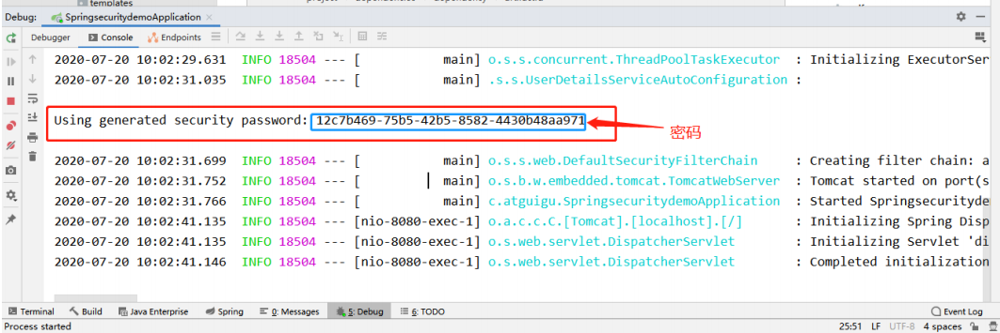

# SpringSecurity

> Spring Security基于Spring框架，提供了一套Web应用安全性的完整解决方案。

Web应用的安全性包括**用户认证(Authentication)和用户授权(Authorization)**两个部分，这两点也是Spring Security重要核心功能。

1. 用户认证指的是：验证某个用户是否为系统中的合法主体，也就是说用户能否访问该系统。即**系统认为用户是否能登录**。
2. 用户授权指的是验证某个用户是否又权限执行某个操作。即**系统判断用户是否有权限去做某些事情**。

**常见的安全管理技术栈组合**（仅是推荐的组合，单纯从技术上来说，怎么组合都可以运行）

- ​	SSM + Shiro
- ​    Spring Boot/Spring Cloud + Spring Security

## 入门

创建Spring Boot项目，引入依赖

```xml
        <dependency>
            <groupId>org.springframework.boot</groupId>
            <artifactId>spring-boot-starter-web</artifactId>
        </dependency>

        <dependency>
            <groupId>org.springframework.boot</groupId>
            <artifactId>spring-boot-starter-security</artifactId>
        </dependency>
		<dependency>
            <groupId>org.springframework.boot</groupId>
            <artifactId>spring-boot-starter-test</artifactId>
            <scope>test</scope>
        </dependency>
```

添加一个配置类：

```java
@Configuration
public class SecutiryConfig extends WebSecurityConfigurerAdapter {
    @Override
    protected void configure(AuthenticationManagerBuilder auth) throws Exception {
        BCryptPasswordEncoder passwordEncoder = new BCryptPasswordEncoder();
        String password = passwordEncoder.encode("123");
        auth.inMemoryAuthentication().withUser("lmj").password(password).roles("admin");
    }
    @Bean
    PasswordEncoder password(){
        return new BCryptPasswordEncoder();
    }
}
```

运行，访问localhost:8080


默认用户名：user，密码在项目启动时会在控制台打印，**每次启动密码都会发生变化**



## SpringSecurity基本原理

SpringSecurity 本质是一个过滤器链：

从启动时可以获取到过滤器链：


**代码底层流程：重点看三个过滤器：**

```java
FilterSecurityInterceptor:是一个方法级的权限过滤器，基本位于过滤链的最底部。
super.beforeInvocation(fi)表示查看之前的filter是否通过。
fi.getChain().doFilter(fi.getRequest(),fi.getResponse());表示真正的调用后台的服务。
ExceptionTranslationFilter:是一个异常过滤器，用来处理在认证授权过程中抛出的异常 
UsernamePasswordAuthenticationFilter:对/login的POST请求做拦截，校验表单中的用户名，密码。    
```

### UserDetailsService接口

> 当什么都没有配置的时候，账号和密码由Spring Security定义生成。在实际项目中账号和密码都是从数据库中查询出来。一般我们要通过自定义逻辑控制认证逻辑。

当需要自定义逻辑时，只需要实现UserDetailsService接口即可。

```java
public interface UserDetailsService {
    UserDetails loadUserByUsername(String username) throws UsernameNotFoundException;
}
```

**总结：**

```java
UserDetailsService接口：查询数据库用户名和密码的过程
 * 创建类继承UsernamePasswordAuthenticationFilter，重写三个方法
 * 创建类实现UserDetailService，编写查询数据过程，返回User对象，这个User对象时安全框架提供对象    
```

### PasswordEncoder接口

> 数据加密的接口，用于返回User对象里面的密码加密。

## Web权限方案

**1、认证  2、授权**

### **设置登录的用户名和密码**

#### 第一种方式：通过配置文件

application.properties

```properties
server.port=8111
spring.security.user.name=lmj
spring.security.user.password=lmj
```

#### 第二种方式：通过配置类

```java
@Configuration
public class SecutiryConfig extends WebSecurityConfigurerAdapter {
    @Override
    protected void configure(AuthenticationManagerBuilder auth) throws Exception {
        BCryptPasswordEncoder passwordEncoder = new BCryptPasswordEncoder();
        String password = passwordEncoder.encode("123");
        auth.inMemoryAuthentication().withUser("lmj").password(password).roles("admin");
    }
    @Bean
    PasswordEncoder password(){
        return new BCryptPasswordEncoder();
    }
}
```

#### 第三种方式：自定义编写实现类

 **第一步 创建配置类，设置使用哪个userDetailsService实现类**

 ```java
 @Configuration
 public class SecurityConfigTest extends WebSecurityConfigurerAdapter {
     @Autowired
     private UserDetailsService userDetailsService;
     @Override
     protected void configure(AuthenticationManagerBuilder auth) throws Exception {
         auth.userDetailsService(userDetailsService).passwordEncoder(password());
     }
     @Bean
     PasswordEncoder password(){
         return new BCryptPasswordEncoder();
     }
 }
 ```

 **第二步 编写实现类，返回User对象，User对象有用户名密码和操作权限**

```java
@Service("userDetailsService")
public class MyUserDetailsService implements UserDetailsService {
    @Override
    public UserDetails loadUserByUsername(String username) throws UsernameNotFoundException {
        List<GrantedAuthority> auths =
                AuthorityUtils.commaSeparatedStringToAuthorityList("role");
        //从查询数据库返回users对象，得到用户名和密码，返回
        return new User("lmj",
                new BCryptPasswordEncoder().encode("123"), auths);
    }
}
```

#### 查询数据库完整用户认证

**引入相关依赖**

```xml
        <dependency>
            <groupId>com.baomidou</groupId>
            <artifactId>mybatis-plus-boot-starter</artifactId>
            <version>3.5.1</version>
        </dependency>
        <dependency>
            <groupId>mysql</groupId>
            <artifactId>mysql-connector-java</artifactId>
        </dependency>
```

**创建数据库和数据表**


**创建users表对应实体类**

```java
@Data
public class Users {
    private Integer id;
    private String username;
    private String password;
}
```

**整合map,创建接口，继承mp的接口**

```java
@Repository
public interface UsersMapper extends BaseMapper<Users> {
}
```

**在MyUserDetailsService调用mapper里面的方法查询数据库进行用户认证**

```java
@Service("userDetailsService")
public class MyUserDetailsService implements UserDetailsService {
    @Autowired
    private UsersMapper usersMapper;
    @Override
    public UserDetails loadUserByUsername(String username) throws UsernameNotFoundException {
        //调用usersMapper方法，根据用户名查询数据库
        QueryWrapper<Users> wrapper = new QueryWrapper();
        wrapper.eq("username", username);
        Users users = usersMapper.selectOne(wrapper);
        //判断
        if (users == null) {//数据库没有用户名，认证失败
            throw new UsernameNotFoundException("用户名不存在！");
        }
        List<GrantedAuthority> auths =
                AuthorityUtils.commaSeparatedStringToAuthorityList("role");
        //从查询数据库返回users对象，得到用户名和密码，返回
        return new User(users.getUsername(),
                new BCryptPasswordEncoder().encode(users.getPassword()), auths);
    }
}
```

**在启动类添加注解 MapperScan**

```java
@SpringBootApplication
@MapperScan("com.lmj.securitydemo1.mapper")
public class Securitydemo1Application {
    public static void main(String[] args) {
        SpringApplication.run(Securitydemo1Application.class, args);
    }
}
```

**配置数据库信息**

```properties
spring.datasource.driver-class-name=com.mysql.cj.jdbc.Driver
spring.datasource.url=jdbc:mysql://localhost:3306/springsecutirydemo1?serverTimezone=Asia/Shanghai&useUnicode=true&characterEncoding=utf-8&zeroDateTimeBehavior=convertToNull&useSSL=false&allowPublicKeyRetrieval=true
spring.datasource.username=root
spring.datasource.password=root
```

### 自定义登录页面

**引入前端模板依赖**

```xml
        <dependency>
            <groupId>org.springframework.boot</groupId>
            <artifactId>spring-boot-starter-thymeleaf</artifactId>
            <version>2.6.7</version>
        </dependency>
```

**创建相关页面，编写控制器**

```html
<form action="/user/login" method="post">
	用户名：<input type="text" name="username">
	<br/>
	密码：<input type="text" name="password">
	<br/>
	<input type="submit" value="login">
</form>
```

```java
@RestController
@RequestMapping("/test")
public class TestController {
    @GetMapping("/index")
    public String index(){
        return "hello index";
    }
}
```

**编写配置类放行登录页面以及静态资源**

```java
@Configuration
public class SecurityConfigTest extends WebSecurityConfigurerAdapter {
    @Bean
    PasswordEncoder password(){
        return new BCryptPasswordEncoder();
    }
    @Override
    protected void configure(HttpSecurity http) throws Exception {
        http.formLogin() //自定义自己编写的登录页面
                .loginPage("/login.html") //登录页面设置
                .loginProcessingUrl("/user.login") //登录访问路径
                .defaultSuccessUrl("/test/index").permitAll() //登录成功之后，跳转路径
                .and().authorizeHttpRequests()
                    .antMatchers("/","/test/hello","/user/login").permitAll() //设置哪些路径可以直接访问，不需要认证
                .anyRequest().authenticated()
                .and().csrf().disable(); //关闭csrf防护
    }
}
```

### 基于角色或权限进行访问控制

#### hasAuthority 方法

> 如果当前的主题具有指定的权限，则返回true，否则返回false

**配置类**

```java
@Override
protected void configure(HttpSecurity http) throws Exception {
        http.formLogin() //自定义自己编写的登录页面
                .loginPage("/login.html") //登录页面设置
                .loginProcessingUrl("/user/login") //登录访问路径
                .defaultSuccessUrl("/test/index").permitAll() //登录成功之后，跳转路径
                .and().authorizeHttpRequests()
                    .antMatchers("/","/test/hello","/user/login").permitAll() //设置哪些路径可以直接访问，不需要认证
                    //当前登录用户，只有具有admins权限才可以访问这个路径
                    .antMatchers("/test/index").hasAuthority("admins")
                    .anyRequest().authenticated()
                .and().csrf().disable(); //关闭csrf防护
    }
```

**Service**

```java
List<GrantedAuthority> auths =
                AuthorityUtils.commaSeparatedStringToAuthorityList("admins");
```

#### hasAnyAuthority方法

> 如果当前的主体有任何提供的角色(给定的作为一个逗号分隔的字符串)的话，然会true

**配置类**

```java
//hasAnyAuthority
.antMatchers("/test/index").hasAnyAuthority("admins","manager")
```

**Service**

```java
List<GrantedAuthority> auths =
                AuthorityUtils.commaSeparatedStringToAuthorityList("admins");
```

#### hasRole方法

> 如果用户具备给定角色就允许访问，否则出现403，如果当前主体具有指定的角色，则返回true

**配置类**

```java
//hasRole方法
.antMatchers("/test/index").hasRole("sale")
```

**Service**（hasRole源码里会加上前缀："ROLE_"）

```java
List<GrantedAuthority> auths =
                AuthorityUtils.commaSeparatedStringToAuthorityList("admins,ROLE_sale");
```

#### hasAnyRole(与上面同理)

### 自定义403没有权限访问页面

**创建页面**

```html
<h1>没有访问的权限!</h1>
```

**在配置类配置**

```java
@Override
protected void configure(HttpSecurity http) throws Exception {
	//配置没有权限访问跳转自定义页面
	http.exceptionHandling().accessDeniedPage("/unauth.html");
```

### 认证授权注解使用

> 使用注解先要开启注解功能(可以在启动类上添加)：@EnableGlobalMethodSecurity(securedEnabled = true)

#### @Secured

> 用户具有某个角色，可以访问方法

```java
    @GetMapping("/update")
    @Secured({"ROLE_sale","ROLE_manager"})
    public String update() {
        System.out.println("update。。。。");
        return "hello update";
    }
```

```java
List<GrantedAuthority> auths =
                AuthorityUtils.commaSeparatedStringToAuthorityList("admins,ROLE_sale");
```

#### @PreAuthorize

```java
@EnableGlobalMethodSecurity(securedEnabled = true,prePostEnabled = true)
```

> 方法之前进行校验

```java
    @GetMapping("/update")
    @PreAuthorize("hasAuthority('abc')")
    public String update() {
        System.out.println("update。。。。");
        return "hello update";
    }
```

```java
List<GrantedAuthority> auths =
                AuthorityUtils.commaSeparatedStringToAuthorityList("admins,ROLE_sale");
```

#### @PostAuthorize

```java
@EnableGlobalMethodSecurity(securedEnabled = true,prePostEnabled = true)
```

> 方法执行之后校验

#### @PostFilter与@PerFilter

> @PostFilter：方法返回数据进行过滤
>
> @PerFilter：传入方法数据进行过滤

### 用户退出

**配置类**

```java
//退出
http.logout().logoutUrl("/logout").logoutSuccessUrl("/test/hello").permitAll();
```

**测试**

```java
1、修改配置类，登录成功之后跳转到成功页面
2、在成功页面添加超链接，写设置退出路径
3、登录成功之后，在成功页面点击退出再去访问其他controller不能进行访问    
```

```html
<body>
  <h1>登录成功！</h1>
  <a href="/logout">退出</a>
</body>
```

### 记住用户

> 1、Cookie技术	2、安全框架机制实现自动登录


**实现**

**创建数据库表**

```sql
CREATE TABLE `persistent_logins` (
 `username` varchar(64) NOT NULL,
 `series` varchar(64) NOT NULL,
 `token` varchar(64) NOT NULL,
 `last_used` timestamp NOT NULL DEFAULT CURRENT_TIMESTAMP ON UPDATE 
CURRENT_TIMESTAMP,
 PRIMARY KEY (`series`)
) ENGINE=InnoDB DEFAULT CHARSET=utf8;
```

**配置类**

```java
    @Autowired
    private DataSource dataSource;
    //配置对象
    @Bean
    public PersistentTokenRepository persistentTokenRepository(){
        JdbcTokenRepositoryImpl jdbcTokenRepository = new JdbcTokenRepositoryImpl();
        jdbcTokenRepository.setDataSource(dataSource);
        //jdbcTokenRepository.setCreateTableOnStartup(true);
        return jdbcTokenRepository;
    }
```

```java
	.and().rememberMe().tokenRepository(persistentTokenRepository())
	.tokenValiditySeconds(60)//设置有效时长，单位秒
	.userDetailsService(userDetailsService)
```

**登录页添加复选框**

```html
        <br/>
        <input type="checkbox" name="remember-me">自动登录
```

### CSRF

> 跨站请求伪造，利用网站对用户网页浏览器的信任

**Spring Security实现CSRF原理**

```java
1、生成csrfToken保存到HttpSession或者Cookie中
2、请求到来时，从请求中提取csrfToken，和保存的csrfToken做比较，进而判断当前请求是否合法。只要通过CsrfFilter过滤器来完成。    
```

## 微服务权限方案

