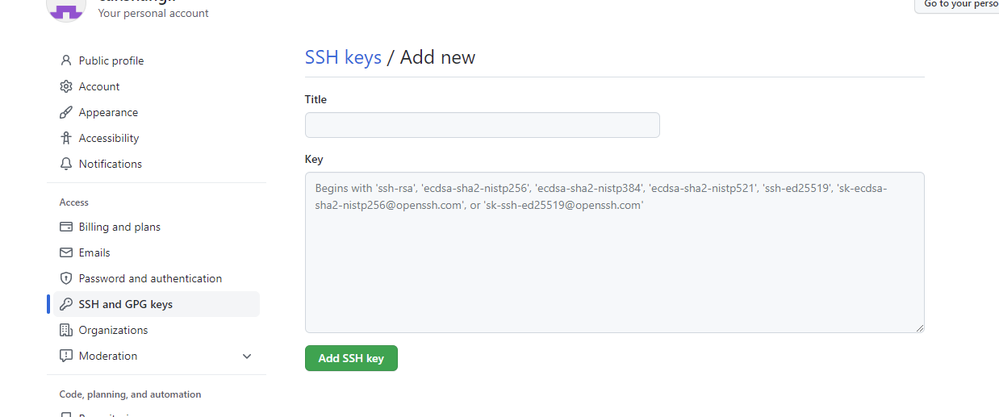

# Git

> Git是一个免费、开源的分布式版本控制系统，可以快速高效地处理从小型到大型的各种项目。
>
> Git易于学习，占地面积小，性能极快。具有廉价的本地库，方便的暂存区域和多个工作流分支等特性。

## 版本控制

> 版本控制是一种记录文件内容变化，以便将来查阅特定版本修订情况的系统。
>
> 版本控制其实最重要的是可以记录文件修改历史记录，从而让用户能够查看历史版本，方便版本切换。

**版本控制：个人开发过渡到团队协作**

### 版本控制工具

- **集中式版本控制工具**

  ```java
  CVS、SVN(Subversion)、VSS....
  好处：可以在一定程度上看到项目中其他人正在做些什么，集中化的版本控制系统，维护轻松。
  坏处：中央服务器的单点故障，如果服务器宕机一小时，那么在这一小时内，谁都无法提交更新，协同工作
  ```

- **分布式版本控制工具**

  ```java
  Git、Mercurial、Bazaar、Darcs...
  分布式的版本控制系统出现后，解决了集中式版本控制系统的缺陷：
  1、服务器断网的情况下页可以进行开发(因为版本控制实在本地进行的)
  2、每隔客户端保存的也都是整个完整的项目(包括历史记录，更加安全)    
  ```

## Git工作机制		


## Git和代码托管中心

代码托管中心是基于网络服务器的远程代码仓库，一般我们简单称为远程库。

- **局域网**
  - **GitLab**
- **互联网**
  - **GitHub(外网)**
  - **Gitee码云(国内网站)**

## Git常用命令

| 命令名称                             | 作用           |
| ------------------------------------ | -------------- |
| git config --global user.name 用户名 | 设置用户签名   |
| git config --global user.email 邮箱  | 设置用户签名   |
| git init                             | 初始化本地库   |
| git status                           | 查看本地库状态 |
| git add 文件名                       | 添加到暂存区   |
| git commit -m "日志信息" 文件名      | 提交到本地库   |
| git reflog                           | 查看历史记录   |
| git reset --hard 版本号              | 版本穿梭       |

### 设置用户签名

**基本语法**

> **git config --global user.name 用户名**
>
> **git config --global user.email 邮箱**

```bash
Administrator@DESKTOP-GSL62TB MINGW64 /e/gitproject/尚硅谷Git、GitHub、Gitee码云、GitLab（IDEA版本）/笔记/Test
$ git config --global user.name lmj

Administrator@DESKTOP-GSL62TB MINGW64 /e/gitproject/尚硅谷Git、GitHub、Gitee码云、GitLab（IDEA版本）/笔记/Test
$ git config --global user.email a2863039606@163.com
```

**说明：**

​	签名的作用是区分不同操作者身份。用户的签名信息在每一个版本的提交信息中都能够看到，此次确认本次提交是谁做的。Git 首次安装必须设置一下用户签名，否则无法提交代码。

**注意：**

> **这里设置用户签名和将来登录GitHub（或其他代码托管中心）的账号没有任何关系。**

### 初始化本地库

**基本语法**

> **git init**

```bash
Administrator@DESKTOP-GSL62TB MINGW64 /e/git笔记/project/test/gitdemo
$ git init
Initialized empty Git repository in E:/git笔记/project/test/gitdemo/.git/

Administrator@DESKTOP-GSL62TB MINGW64 /e/git笔记/project/test/gitdemo (master)
$ ll -a
total 4
drwxr-xr-x 1 Administrator 197121 0 Jun 30 15:34 ./
drwxr-xr-x 1 Administrator 197121 0 Jun 30 15:34 ../
drwxr-xr-x 1 Administrator 197121 0 Jun 30 15:34 .git/
```


### 查看本地状态

**基本语法**

> **git status**

**首次查看**（工作区没有任何文件）

```bash
Administrator@DESKTOP-GSL62TB MINGW64 /e/git笔记/project/test/gitdemo (master)
$ git status
On branch master

No commits yet

nothing to commit (create/copy files and use "git add" to track)
```

**使用vim命令新增文件，并用cat命令查看文件**

```base
Administrator@DESKTOP-GSL62TB MINGW64 /e/git笔记/project/test/gitdemo (master)
$ cat hello.txt
hello lmj! hello lmj!
hello lmj! hello lmj!

hello lmj! hello lmj!
hello lmj! hello lmj!
hello lmj! hello lmj!
hello lmj! hello lmj!
hello lmj! hello lmj!
hello lmj! hello lmj!
hello lmj! hello lmj!
hello lmj! hello lmj!
```

**再次查看**（检测到未追踪的文件）

```bash
Administrator@DESKTOP-GSL62TB MINGW64 /e/git笔记/project/test/gitdemo (master)
$ git status
On branch master

No commits yet

Untracked files:
  (use "git add <file>..." to include in what will be committed)
        hello.txt

nothing added to commit but untracked files present (use "git add" to track)
```

### 添加暂存区

**将工作区的文件添加到暂存区**

**基本语法**

> **git add 文件名**

```bash
Administrator@DESKTOP-GSL62TB MINGW64 /e/git笔记/project/test/gitdemo (master)
$ git add hello.txt
warning: LF will be replaced by CRLF in hello.txt.
The file will have its original line endings in your working directory
```

**查看状态**(检查到暂存区有新文件)

```bash
Administrator@DESKTOP-GSL62TB MINGW64 /e/git笔记/project/test/gitdemo (master)
$ git status
On branch master

No commits yet

Changes to be committed:
  (use "git rm --cached <file>..." to unstage)
        new file:   hello.txt
```

**删除暂存区文件**（相当于撤回添加暂存区）

```bash
Administrator@DESKTOP-GSL62TB MINGW64 /e/git笔记/project/test/gitdemo (master)
$ git rm --cached hello.txt
rm 'hello.txt'
```

### 提交本地库

**将暂存区的文件提交到本地库**

**基本语法**

> **git commit -m "日志信息" 文件名**

```bas
Administrator@DESKTOP-GSL62TB MINGW64 /e/git笔记/project/test/gitdemo (master)
$ git commit -m "first commit" hello.txt
warning: LF will be replaced by CRLF in hello.txt.
The file will have its original line endings in your working directory
[master (root-commit) ee88c87] first commit
 1 file changed, 76 insertions(+)
 create mode 100644 hello.txt
```

**查看状态**（没有文件需要提交）

```ba
Administrator@DESKTOP-GSL62TB MINGW64 /e/git笔记/project/test/gitdemo (master)
$ git status
On branch master
nothing to commit, working tree clean
```

### 修改文件

**修改并查看**

```bash
$ cat hello.txt
update!!!!!!!!!!已修改1
hello lmj! hello lmj!
hello lmj! hello lmj!
hello lmj! hello lmj!
hello lmj! hello lmj!
hello lmj! hello lmj!
hello lmj! hello lmj!
hello lmj! hello lmj!
hello lmj! hello lmj!
```

**查看状态**（检测到工作区有文件被修改）

```bash
Administrator@DESKTOP-GSL62TB MINGW64 /e/git笔记/project/test/gitdemo (master)
$ git status
On branch master
Changes not staged for commit:
  (use "git add <file>..." to update what will be committed)
  (use "git restore <file>..." to discard changes in working directory)
        modified:   hello.txt
```

**将修改的文件再次添加到暂存区**

```bash
Administrator@DESKTOP-GSL62TB MINGW64 /e/git笔记/project/test/gitdemo (master)
$ git add hello.txt
warning: LF will be replaced by CRLF in hello.txt.
The file will have its original line endings in your working directory
```

**查看状态**（工作区的修改添加到了暂存区）

```bash
Administrator@DESKTOP-GSL62TB MINGW64 /e/git笔记/project/test/gitdemo (master)
$ git status
On branch master
Changes to be committed:
  (use "git restore --staged <file>..." to unstage)
        modified:   hello.txt
```

### 历史版本 

**基础语法**

> **git reflog 查看版本信息**
>
> **git log 查看版本详细信息**

```bash
Administrator@DESKTOP-GSL62TB MINGW64 /e/git笔记/project/test/gitdemo (master)
$  git reflog
d780176 (HEAD -> master) HEAD@{0}: commit: second commit
ee88c87 HEAD@{1}: commit (initial): first commit
```

### 版本穿梭

```bash
#首先查看当前的历史版本记录
Administrator@DESKTOP-GSL62TB MINGW64 /e/git笔记/project/test/gitdemo (master)
$  git reflog
d780176 (HEAD -> master) HEAD@{0}: commit: second commit
ee88c87 HEAD@{1}: commit (initial): first commit
#切换到ee88c87版本
Administrator@DESKTOP-GSL62TB MINGW64 /e/git笔记/project/test/gitdemo (master)
$ git reset --hard ee88c87
HEAD is now at ee88c87 first commit
#切换完毕后再查看历史记录，成功切换到了ee88c87版本
Administrator@DESKTOP-GSL62TB MINGW64 /e/git笔记/project/test/gitdemo (master)
$ git reflog
ee88c87 (HEAD -> master) HEAD@{0}: reset: moving to ee88c87
d780176 HEAD@{1}: commit: second commit
ee88c87 (HEAD -> master) HEAD@{2}: commit (initial): first commit
#查看文件hello.txt
Administrator@DESKTOP-GSL62TB MINGW64 /e/git笔记/project/test/gitdemo (master)
$ cat hello.txt
hello lmj! hello lmj!
hello lmj! hello lmj!
hello lmj! hello lmj!
```

> Git切换版本，底层其实是移动的HEAD指针。

## Git分支操作


> 在版本控制过程中，同时推进多个任务，为每个任务，我们就可以创建每个任务的单独分支。使用分支意味着程序员可以把自己的工作从开发主线上分离开来，开发自己分支的时候，不会影响主线分支的运行。


**分支的好处**

- 同时并行推进多个功能开发，提高开发效率。
- 各个分支在开发过程中，如果某一个分支开发失败，不会对其他分支有任何影响。失败的分支删除重新开始即可。

### 分支的操作

| 命令名称            | 作用                         |
| ------------------- | ---------------------------- |
| git branch 分支名   | 创建分支                     |
| git branch -v       | 查看分支                     |
| git checkout 分支名 | 切换分支                     |
| git merge 分支名    | 把指定的分支合并到当前分支上 |

### 查看分支

**基本语法**

> **git branch -v**

```ba
Administrator@DESKTOP-GSL62TB MINGW64 /e/git笔记/project/test/gitdemo (master)
$ git branch -v
* master ee88c87 first commit
```

### 创建分支

**基本语法**

> **git branch** **分支名**

```bash
Administrator@DESKTOP-GSL62TB MINGW64 /e/git笔记/project/test/gitdemo (master)
$ git branch hot-fix

Administrator@DESKTOP-GSL62TB MINGW64 /e/git笔记/project/test/gitdemo (master)
$ git branch -v
  hot-fix ee88c87 first commit
* master  ee88c87 first commit
```

### **修改分支**

```bash
Administrator@DESKTOP-GSL62TB MINGW64 /e/git笔记/project/test/gitdemo (master)
$ vim hello.txt

Administrator@DESKTOP-GSL62TB MINGW64 /e/git笔记/project/test/gitdemo (master)
$ git add hello.txt

Administrator@DESKTOP-GSL62TB MINGW64 /e/git笔记/project/test/gitdemo (master)
$ git commit -m "my forth commit" hello.txt
[master f363b4c] my forth commit
1 file changed, 1 insertion(+), 1 deletion(-)

Administrator@DESKTOP-GSL62TB MINGW64 /e/git笔记/project/test/gitdemo (master)
$ git branch -v
 hot-fix 087a1a7 my third commit （hot-fix 分支并未做任何改变）
* master f363b4c my forth commit （当前 master 分支已更新为最新一次提交
的版本）
```

### 切换分支

**基本语法**

```bash
Administrator@DESKTOP-GSL62TB MINGW64 /e/git笔记/project/test/gitdemo (master)
$ git checkout hot-fix
Switched to branch 'hot-fix'
#在 hot-fix 分支上做修改
Administrator@DESKTOP-GSL62TB MINGW64 /e/git笔记/project/test/gitdemo (hot-fix)
$ cat hello.txt
hello lmj! hello lmj! 222222
hello lmj! hello lmj!
hello lmj! hello lmj!
hello lmj! hello lmj!
hello lmj! hello lmj!
hello lmj! hello lmj!
#添加暂存区
Administrator@DESKTOP-GSL62TB MINGW64 /e/git笔记/project/test/gitdemo (hot-fix)
$ git add hello.txt
#提交本地库
Administrator@DESKTOP-GSL62TB MINGW64 /e/git笔记/project/test/gitdemo (hot-fix)
$ git status
On branch hot-fix
Changes to be committed:
  (use "git restore --staged <file>..." to unstage)
        modified:   hello.txt
```

### 合并分支

**基础语法**

> **git merge** **分支名**

```bash
Administrator@DESKTOP-GSL62TB MINGW64 /e/git笔记/project/test/gitdemo (master)
$ git merge hot-fix
Updating ee88c87..2787ee1
Fast-forward
 hello.txt | 72 +--------------------------------------------------------------
 1 file changed, 1 insertion(+), 71 deletions(-)
```

### **产生冲突**

> 冲突产生的表现：后面状态为MERGING

```bash
Administrator@DESKTOP-GSL62TB MINGW64 /e/git笔记/project/test/gitdemo (master|MERGING)
$ cat hello.txt
hello git! hello atguigu! 2222222222222
hello git! hello atguigu! 3333333333333
<<<<<<< HEAD
hello git! hello atguigu! master test
hello git! hello atguigu!
=======
hello git! hello atguigu!
hello git! hello atguigu! hot-fix test
>>>>>>> hot-fix
```

**冲突产生的原因：**

合并分支时，两个分支在**同一个文件的同一个位置**有两套完全不同的修改。Git 无法替我们决定使用哪一个。必须**人为决定**新代码内容。查看状态（检测到有文件有两处修改）

```bash
Administrator@DESKTOP-GSL62TB MINGW64 /e/git笔记/project/test/gitdemo (master|MERGING)
$ git status
On branch master
You have unmerged paths.
  (fix conflicts and run "git commit")
  (use "git merge --abort" to abort the merge)

Unmerged paths:
  (use "git add <file>..." to mark resolution)
        both modified:   hello.txt

no changes added to commit (use "git add" and/or "git commit -a")
```

### 解决冲突

1. 编辑有冲突的文件，删除特殊符号，决定要使用的内容

   特殊符号：<<<<<<< HEAD 当前分支的代码 ======= 合并过来的代码 >>>>>>> hot-fix

   ```bash
   hello git! hello atguigu! 2222222222222
   hello git! hello atguigu! 3333333333333
   hello git! hello atguigu! master test
   hello git! hello atguigu! hot-fix test
   ```

2. 添加到暂存区

   ```ba
   Administrator@DESKTOP-GSL62TB MINGW64 /e/git笔记/project/test/gitdemo (master|MERGING)
   $ git add hello.txt
   ```

3. 执行提交（注意：此时使用 git commit 命令时**不能带文件名**）

```bash
Administrator@DESKTOP-GSL62TB MINGW64 /e/git笔记/project/test/gitdemo (master|MERGING)
$ git commit -m "merge test"
[master 927816b] merge test
Administrator@DESKTOP-GSL62TB MINGW64 /e/git笔记/project/test/gitdemo (master)
$
```

### 创建分支和切换分支图解


```bash
master、hot-fix 其实都是指向具体版本记录的指针。当前所在的分支，其实是由 HEAD决定的。所以创建分支的本质就是多创建一个指针。
HEAD 如果指向 master，那么我们现在就在 master 分支上。
HEAD 如果执行 hotfix，那么我们现在就在 hotfix 分支上。
所以切换分支的本质就是移动 HEAD 指针。
```

### Git 团队协作机制

#### 团队内协作


#### 跨团队协作


## GitHub 操作

**GitHub 网址：**[https://github.com/](https://github.com/)

**在GitHub上创建用户，创建远程仓库，并复制远程仓库链接：**

https://github.com/canshangll/gitdemo.git

### 远程仓库操作

| **命令名称**                       | **作用**                             |
| ---------------------------------- | ------------------------------------ |
| git remote -v                      | 查看当前所有远程地址别名             |
| git remote add 别名 远程地址       | 起别名                               |
| git push 别名 分支                 | 推送本地分支上的内容到远程仓库       |
| git clone 远程地址                 | 将远程仓库的内容克隆到本地           |
| git pull 远程库地址别名 远程分支名 | 将远程仓库对于分支最新内容拉下来后与 |

### 创建远程仓库别名

**基本语法**

> **git remote -v** **查看当前所有远程地址别名**
>
> **git remote add** **别名 远程地址**

```bash
Administrator@DESKTOP-GSL62TB MINGW64 /e/git笔记/project/test/gitdemo (hot-fix)
$ git remote -v

Administrator@DESKTOP-GSL62TB MINGW64 /e/git笔记/project/test/gitdemo (hot-fix)
$ git remote add gitdemo https://github.com/canshangll/gitdemo.git

Administrator@DESKTOP-GSL62TB MINGW64 /e/git笔记/project/test/gitdemo (hot-fix)
$ git remote -v
gitdemo https://github.com/canshangll/gitdemo.git (fetch)
gitdemo https://github.com/canshangll/gitdemo.git (push)
```

### 推送本地分支到远程仓库

**基本语法**

> **git push** **别名 分支**

```bash
Administrator@DESKTOP-GSL62TB MINGW64 /e/git笔记/project/test/gitdemo (master)
$ git push gitdemo master
Enumerating objects: 15, done.
Counting objects: 100% (15/15), done.
Delta compression using up to 16 threads
Compressing objects: 100% (10/10), done.
Writing objects: 100% (15/15), 1.14 KiB | 1.14 MiB/s, done.
Total 15 (delta 5), reused 0 (delta 0), pack-reused 0
remote: Resolving deltas: 100% (5/5), done.
To https://github.com/canshangll/gitdemo.git
 * [new branch]      master -> master
```


### 拉取远程仓库到本地分支

**基本语法**

> git pull 链接 分支

```bash
Administrator@DESKTOP-GSL62TB MINGW64 /e/git笔记/project/test/gitdemo (master)
$ git pull gitdemo master
remote: Enumerating objects: 5, done.
remote: Counting objects: 100% (5/5), done.
remote: Compressing objects: 100% (2/2), done.
remote: Total 3 (delta 1), reused 0 (delta 0), pack-reused 0
Unpacking objects: 100% (3/3), 658 bytes | 3.00 KiB/s, done.
From https://github.com/canshangll/gitdemo
 * branch            master     -> FETCH_HEAD
   927816b..903280e  master     -> gitdemo/master
Updating 927816b..903280e
Fast-forward
 hello.txt | 4 +++-
 1 file changed, 3 insertions(+), 1 deletion(-)
```

### 克隆远程仓库到本地

**基本语法**

> **git clone** **远程地址**

```bash
a2863@DESKTOP-0HKS6VC MINGW32 /d/gittest
$ git clone https://github.com/canshangll/gitdemo.git
Cloning into 'gitdemo'...
remote: Enumerating objects: 18, done.
remote: Counting objects: 100% (18/18), done.
remote: Compressing objects: 100% (7/7), done.
remote: Total 18 (delta 6), reused 15 (delta 5), pack-reused 0
Receiving objects: 100% (18/18), done.
Resolving deltas: 100% (6/6), done.

a2863@DESKTOP-0HKS6VC MINGW32 /d/gittest/gitdemo (master)
$ git remote -v
origin  https://github.com/canshangll/gitdemo.git (fetch)
origin  https://github.com/canshangll/gitdemo.git (push)
```

> **小结：clone 会做如下操作。1、拉取代码。2、初始化本地仓库。3、创建别名**

### SSH 免密登录

**生成密钥**

```bash
Administrator@DESKTOP-GSL62TB MINGW64 /e/git笔记/project/test/gitdemo (master)
$ ssh-keygen -t rsa -C a2863039606@163.com
```




## IDEA 集成 Git


