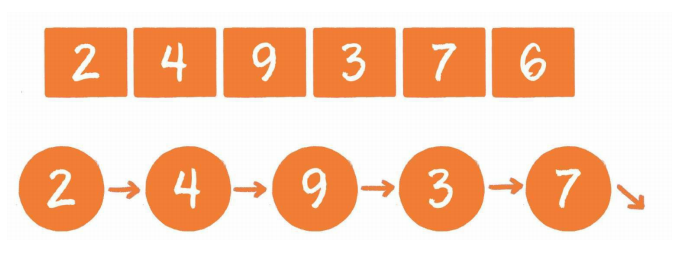
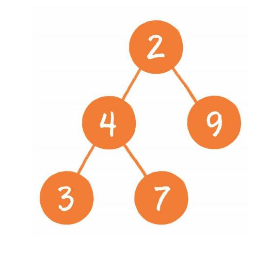
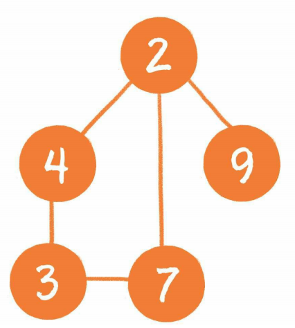

# 算法

## 数据结构

**数据结构，对应的英文单词是data structure ，是数据的组织、 管理和存储格式，其使用目的是为了高效地访问和修改数据。**

### 线性结构 

```java
//线性结构是最简单的数据结构，包括数组、链表，以及由它们衍生出来的栈、队列、哈希表。 
```



### 树

```java
//树是相对复杂的数据结构，其中比较有代表性的是二叉树，由它又 衍生出了二叉堆之类的数据结构。
```



### 图

```java
//图是更为复杂的数据结构，因为在图中会呈现出多对多的关联关系。
```



### 其他数据结构

```java
//它们由基本数据结构变形而来，用于解决某些特定问题，如 跳表、哈希链表、位图等。
```

## 时间复杂度