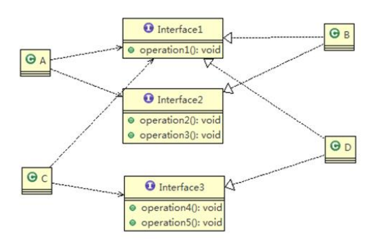
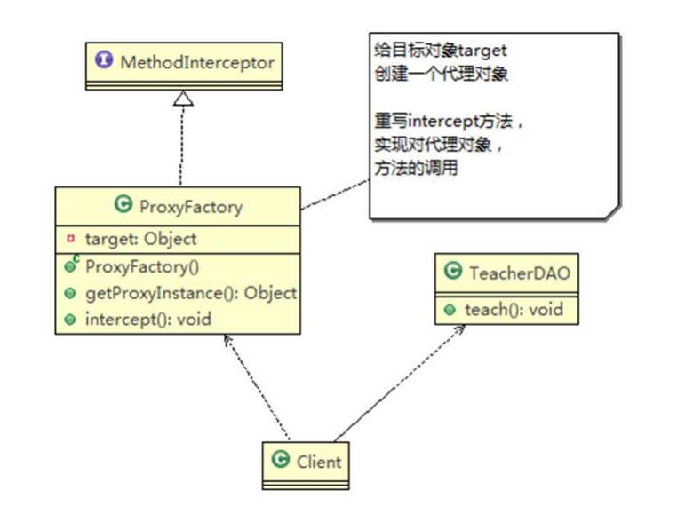
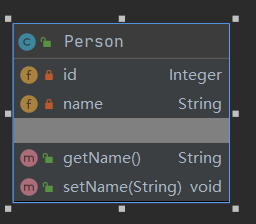

# 设计模式

## 七大原则

```java
//1、单一职责原则
//2、接口隔离原则
//3、依赖倒转原则
//4、里氏替换原则
//5、开闭原则ocp
//6、迪米特法则
//7、合成复用原则
```

### 目的

```java
//1、代码重用性(相同功能的代码，不用多次编写)
//2、可读性(编程规范性，便于其他程序员的阅读和理解)
//3、可扩展性(也称可维护性，增加新的功能时要方便)
//4、可靠性(当增加新的功能后，对原来的功能没有影响)
//5、使程序出现高内聚，低耦合的特性
```

### 单一职责原则

```java
//对类来说的，即一个类应该只负责一项职责。如类A负责两个不同职责：职责1，职责2.当职责1需求变更而改变A时，可能造成职责2执行错误，所以需要将类A的粒度分解为A1，A2
```

**单一职责原理注意事项和细节**

```java
//1、降低类的复杂度，一个类只负责一项职责
//2、提高类的可读性，可维护性
//3、降低变更引起的风险
//4、通常情况下，我们应当遵守单一职责原则，只有逻辑做够简单，才可以在代码级违反单一职责原理；只有类方法数量足够少，可以在方法级别保持单一职责原则
```

### 接口隔离原则

```java
//客户端不应该依赖它不需要的接口，即一个类对另一个类的依赖应该建立在最小的接口上。
```




```java
main{
    A aa = new A(); aa.depend1(new B());//A 类通过接口去依赖B类
	aa.depend2(new B()); aa.depend3(new B());

    C cc = new C(); cc.depend1(new D());
    cc.depend4(new D()); cc.depend5(new D());
}
interface Interface1 { void opt1(); }

interface Interface2 { void opt2(); void opt3(); }

interface Interface3 { void opt4(); void opt5(); }

class B implements Interface1 ,Interface2{ /*实现接口方法*/ }

class D implements Interface1,Interface3 { /*实现接口方法*/}

class A { //A 类通过接口Interface1,Interface2 依赖(使用) B类，但是只会用到1,2,3方法
    public void depend1(Interface1 interface1) { interface1.opt1(); }
    public void depend2(Interface2 interface1) { interface1.opt2(); }
    public void depend3(Interface2 interface1) { interface1.opt3(); }
}
class C { //C 类通过接口Interface1,Interface3 依赖(使用) D类，但是只会用到1,2,3方法
    public void depend1(Interface1 interface1) { interface1.opt1(); }
    public void depend4(Interface3 interface1) { interface1.opt4(); }
    public void depend5(Interface3 interface1) { interface1.opt5(); }
}
```

### 依赖倒转(倒置)原则

```java
//1、高层模块不应该依赖底层模块，二层都应该依赖抽象
//2、抽象不应该依赖细节，细节应该依赖抽象
//3、依赖倒转(倒置)的中心思想是面向接口编程
//4、设计理念：相当于细节的多变性，抽象的东西要稳定的多。以抽象搭建的架构比以细节为基础的架构要稳定的多。抽象指的是接口或抽象类，细节就是具体的实现类
//5、使用接口或抽象类的目的是制定好规范，而不涉及任何具体的操作，把展现细节的任务交给实现类去完成
```

**依赖倒转的注意事项和细节**

```java
//1、底层模块尽量都要有抽象类或接口，或者两者都有，程序稳定性更好
//2、变量的声明类型尽量是抽象类或接口，在变量引用和时间对象间，就存在一个缓冲层，利于程序扩展和优化
//3、基础时遵循里氏替换原则
```

**依赖传递的三种方式**

```java
//1、接口传递
//2、构造方法传递
//3、setter方式传递
```

```java
main{
    changhongTV changhongTV = new changhongTV();
    //接口传递实现依赖
	OpenAndClose openAndClose = new OpenAndClose();
	openAndClose.open(changhongTV);
    //构造器方法传递
	OpenAndClose openAndClose = new OpenAndClose(changhongTV);
	openAndClose.open();
    //setter方法传递
    OpenAndClose openAndClose = new OpenAndClose();
    openAndClose.setTv(changhongTV);
    openAndClose.open();
}

//接口
interface IOpenAndClose {public void open(ITV tv);}
interface ITV { public void play();}
class changhongTV implements ITV{
    @Override
    public void play() { System.out.println("打开长虹电视机"); }
}

//通过构造方法依赖传递
interface IOpenAndClose { public void open(); }
interface ITV { public void play(); }
class OpenAndClose implements IOpenAndClose {
    public ITV tv;
    public OpenAndClose(ITV tv) { this.tv = tv; }
    public void open() { this.tv.play(); }
}
class changhongTV implements ITV{
    @Override
    public void play() { System.out.println("打开长虹电视机"); }
}

//通过setter方法传递
interface IOpenAndClose {
    public void open(); 
    public void setTv(ITV tv);
}
interface ITV { public void play(); }
class OpenAndClose implements IOpenAndClose {
    private ITV tv;
    public void setTv(ITV tv) { this.tv = tv; }
    public void open() { this.tv.play(); }
}
class changhongTV implements ITV{
    @Override
    public void play() { System.out.println("打开长虹电视机"); }
}
```

### 里氏转换原则

```java
//1、所有引用基类的地方必须能透明地使用其子类的对象。
//2、使用继承时，遵循里氏替换原则，在子类中尽量不要重写父类的方法。
//3、继承实际上让两个类增强耦合性，可以通过聚合，组合，依赖，来解决问题。
```

```java
main(String[] args) {
        A a = new A();
        System.out.println("11-3=" + a.fun1(11, 3));//11-3=8
        System.out.println("1-8=" + a.fun1(1, 8));//1-8=-7
        B b = new B();
        //因为B类不再继承A类 因此调用者，不会再fun1是求减法
        //调用完成的功能就会很明确
        System.out.println("11+3=" + b.fun1(11, 3)); //这里的本意是求出11+3
        System.out.println("1-8=" + b.fun1(1, 8));  // 这里 1+8
        System.out.println("11+3+9=" + b.fun2(11, 3));11+3+9=23
        //使用组合仍然可以使用到A类相关方法
        System.out.println("11-3="+b.fun3(11,3));//这里的本意是求出11-3
    }
}
//创建一个更加基础的基类
class Base{//把更加基础的方法和成员写到Base类
}
//A类
class A extends Base {
    // 返回两个数的差
    public int fun1(int num1, int num2) {
        return num1 - num2;
    }
}
//B类继承A类
// 新增一个新功能：完成两个数的相加，然后和9求和
class B extends Base {
    private A a = new A();
    //这里重写了A类的方法，可能是无意识
    public int fun1(int a, int b) {
        return a + b;
    }
    public int fun2(int a, int b) {
        return fun1(a, b) + 9;
    }
    //我们仍然想使用A的方法
    public int fun3(int a,int b){
        return this.a.fun1(a,b);
    }
}
```

### 开闭原则

```java
1、开闭原则是编程中最基础、最重要的设计原则。
2、通过扩展软件实体的行为来实现变化，而不是通过修改已有代码来实现变化。
3、编程中遵循其他原则，以及使用设计模式的目的就是遵循开闭原则。
```

```java
main{
    GraphicEditor graphicEditor = new GraphicEditor();
    graphicEditor.drawShape(new Rectangle());
    graphicEditor.drawShape(new Circle());
    graphicEditor.drawShape(new Triangle());
    graphicEditor.drawShape(new Other());
}

//用于绘图的类
class GraphicEditor {
    //接收Shape对象，根据type，来绘制不同的图形
    public void drawShape(Shape s) {
        s.draw();
    }
}
//Shape类，基类
abstract class Shape {
    int m_type;
    public abstract void draw();//抽象方法
}
class Rectangle extends Shape {
    Rectangle() {
        super.m_type = 1;
    }
    @Override
    public void draw() {
        System.out.println("绘制矩形");
    }
}
class Circle extends Shape {
    public Circle() {
        super.m_type = 2;
    }
    @Override
    public void draw() {
        System.out.println("绘制圆形");
    }
}
class Triangle extends Shape {
    public Triangle() {
        super.m_type = 3;
    }
    @Override
    public void draw() {
        System.out.println("绘制三角形 ");
    }
}
class Other extends Shape {
    public Other() {
        super.m_type = 4;
    }
    @Override
    public void draw() {
        System.out.println("绘制其他图形");
    }
}
```

### 迪米特法则

```java
1、一个对象应该对其他对象保持最少的了解
2、类与类关系越密切，耦合度越大
3、迪米特法则又叫最少知道原则，即一个类对自己依赖的类知道的越少越好，即对外处理提供public方法，不对外泄露任何信息
4、更简单的定义：只与直接的朋友通信
5、直接的朋友：每个对象都会与其他对象有耦合关系，只要两个对象之间有耦合关系，这两个对象之间就是朋友关系，耦合的方式很多：依赖、关联、组合、聚合等。其中：出现在 成员变量，方法参数，方法返回值中的类为直接的朋友，而出现在局部变量中的类不是直接的朋友，要避免出现在局部变量中。    
```

**迪米特法则注意事项和细节**

```java
1、迪米特法则的核心是降低类之间的耦合
2、注意：每个类都减少了不必要的依赖，迪米特法则只是要求降低类之间的耦合关系，并不是要求完全没有依赖关系    
```

```java
main{
    System.out.println("使用迪米特原则的改进");
    SchoolManager schoolManager = new SchoolManager();
    schoolManager.printAllEmployee(new CollegeManager());
}
//学校总部员工类
class Employee {
    private String id;
    public void setId(String id) {
        this.id = id;
    }
    public String getId() {
        return id;
    }
}
//学院的员工
class CollegeEmployee {
    private String id;
    public void setId(String id) {
        this.id = id;
    }
    public String getId() {
        return id;
    }
}
//管理学院员工的管理类
class CollegeManager {
    //返回学院的所有员工
    public List<CollegeEmployee> getAllEmployee() {
        List<CollegeEmployee> list = new ArrayList<CollegeEmployee>();
        for (int i = 0; i < 10; i++) { //增加了10个员工
            CollegeEmployee emp = new CollegeEmployee();
            emp.setId("学院员工id= " + i);
            list.add(emp);
        }
        return list;
    }
    //输出学院员工的信息
    public void printEmployee(){
        List<CollegeEmployee> list1 = getAllEmployee();
        System.out.println("------------学院员工------------");
        for (CollegeEmployee e : list1) {
            System.out.println(e.getId());
        }
    }
}
//管理学校员工的管理类
// SchoolManager的直接朋友 Employee CollegeManager
// CollegeEmployee 不是直接朋友，而是陌生类，违背了迪米特原则
class SchoolManager {
    //返回学校总部的员工
    public List<Employee> getAllEmployee() {
        List<Employee> list = new ArrayList<Employee>();
        for (int i = 0; i < 5; i++) {
            Employee emp = new Employee();
            emp.setId("学校总部员工id= " + i);
            list.add(emp);
        }
        return list;
    }
    //该方法完成输出学校总部和学院员工信息(id)
    void printAllEmployee(CollegeManager sub) {
        //将输出学院的员工的方法，封装到CollegeManager
        //获取学院员工
        sub.printEmployee();
        //获取到学校员工
        List<Employee> list2 = this.getAllEmployee();
        System.out.println("------------学校总部员工------------");
        for (Employee e : list2) {
            System.out.println(e.getId());
        }
    }
}
```

### 合成复用原则

```java
//原则是尽量使用合成/聚合的方式，而不是使用继承  
```

**设计原则核心思想**

```java
1、找出应用中可能需要变化之处，把它们独立出来，不要和那些不需要变化的代码混在一起
2、针对接口编程，而不是针对实现编程
3、为了交互对象之间的松耦合设计而努力    
```

## UML

```java
//UML(统一建模语言)，是一种用于软件系统分析和设计的语言工具。
//UML本身是一套符号的规定，就像数学符号和化学符号一样，符号用来描述软件模型中的各个元素之间的关系，如：类、接口、实现、泛化、依赖、组合、聚合等。
```



### UML类图

```java
1、用与描述系统中的类(对象)本身的组成和类(对象)之间的各种静态关系
2、类之间的关系：依赖、泛化(继承)、实现、关联、聚合与组合    
```

```java
public class Person {
    private Integer id;
    private String name;
    public String getName() {
        return name;
    }
    public void setName(String name) {
        this.name = name;
    }
}
```



### 类图——依赖关系


